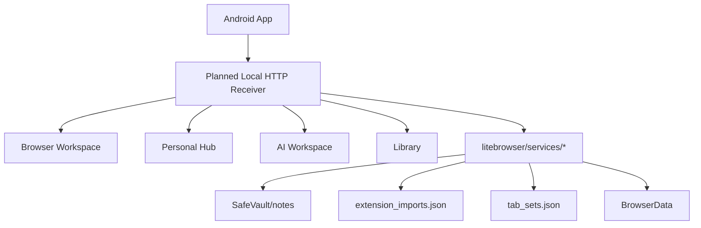
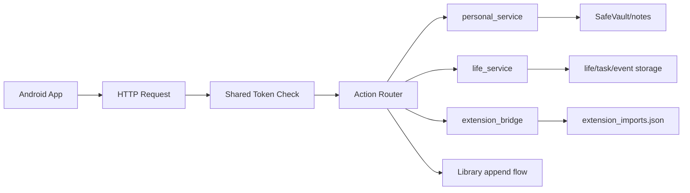
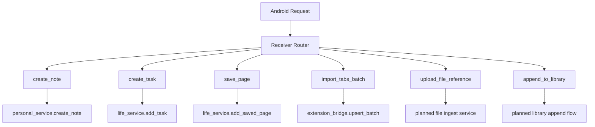
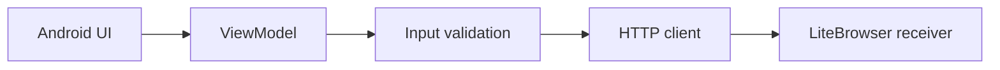
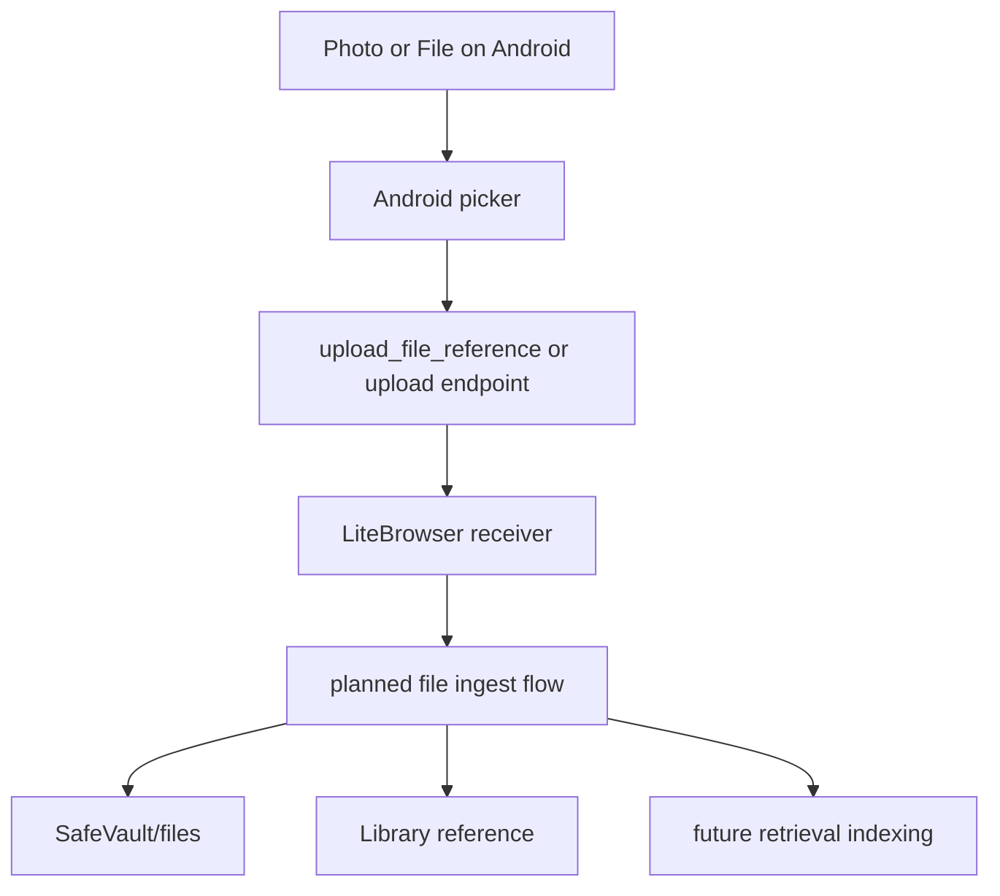
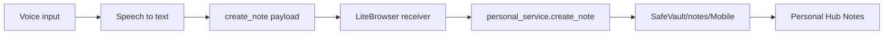

# LiteBrowser Android Bridge Spec

Tai lieu nay mo ta **kien truc du kien** cho Android bridge cua LiteBrowser. Day khong phai mo ta ve mot tinh nang da ton tai trong code hien tai. Muc dich cua spec la de sau nay co the mo mot project Android moi va code dung theo mot giao keo ky thuat ro rang, on dinh, khong can doan lai cach ket noi voi LiteBrowser.

Trong bo canh tong the cua du an, `Browser` van la trung tam. Android app duoc xem nhu mot cau noi ngoai he thong de:

- dieu khi den Browser tu xa
- gui nhanh notes, tasks, tab batches, files, pages vao LiteBrowser
- dong vai tro mobile capture surface cho he sinh thai tri thuc cua LiteBrowser

`Cuc Quan Ly` khong phai trong tam cua spec nay. Tai lieu nay tap trung vao `Browser <-> Android bridge`.

---

## 1. Muc tieu cua Android Bridge

Android bridge duoc de xuat de giai quyet 4 nhom bai toan:

1. Dua du lieu tu dien thoai vao LiteBrowser nhanh va co cau truc.
2. Bien dien thoai thanh remote capture tool cho Browser va Personal Hub.
3. Tranh ghi file truc tiep vao profile khi khong can thiet, uu tien route qua service.
4. Tao mot protocol on dinh de sau nay Android app, browser extension, va cac external clients khac co the noi cung mot kieu.

Phan du kien nay khong thay the extension import tu Chrome/Opera GX. No song song voi extension bridge:

- extension bridge: chuyen tabs tu browser Chromium-family vao LiteBrowser
- Android bridge: chuyen lenh va du lieu tu dien thoai vao LiteBrowser

---

## 2. Vi tri Android app trong kien truc he thong

Android app duoc xem nhu mot external client trong he sinh thai LiteBrowser.

No khong can copy code hoac folder cua LiteBrowser vao Android Studio. Android app chi can biet:

- dia chi host cua may tinh chay LiteBrowser
- port receiver
- shared token
- schema JSON cua protocol

### 2.1 Vai tro logic

Android app co the dong 3 vai tro:

- `Remote Manager`: kich hoat quick actions, gui command, ping desktop
- `Data Sender`: gui note, task, tabs batch, file metadata, saved page metadata
- `Capture Surface`: nhan text, voice-to-text, share intent, file/photo picker roi day vao LiteBrowser

### 2.2 Quan he voi cac khu vuc trong LiteBrowser

- `Browser`
  - nhan tab batches
  - nhan yeu cau save page metadata
  - nhan remote open/import action
- `Personal Hub`
  - nhan note/task/file references
  - hien thi note/task moi sau khi receiver route vao service
- `AI Workspace`
  - co the huong loi tu du lieu moi duoc dua vao SafeVault / library
  - retrieval co the index du lieu duoc Android gui len o buoc sau
- `Library`
  - co the nhan them items tu action `append_to_library`
- `SafeVault`
  - la dich ghi du lieu cho notes, files, va cac artifact khac neu action can luu local

### 2.3 Graph vi tri he thong



---

## 3. Receiver model du kien ben LiteBrowser

### 3.1 Tong quan

Phia LiteBrowser duoc de xuat co mot service moi trong `litebrowser/services/` dong vai tro:

- local HTTP API receiver
- auth gate bang shared token
- action router
- error formatter
- logging/coarse audit

Ten file chi la goi y:

- `litebrowser/services/android_bridge_service.py`
- hoac `litebrowser/services/remote_ingest_service.py`

Spec nay uu tien model:

- protocol nhat quan
- de debug
- khong phu thuoc native Android file access
- khong yeu cau Android ghi truc tiep vao `runtime_data/profiles/...`

### 3.2 Cach bind mang

Receiver du kien:

- mac dinh bind `127.0.0.1`
- co tuy chon cho phep bind theo LAN interface khi user bat Android bridge
- tuyet doi khong mo public internet

Khuyen nghi policy:

- local default: `127.0.0.1:<port>`
- LAN mode: `<LAN_IP>:<port>`
- khong port-forward
- khong NAT expose
- khong cloud relay trong phase nay

### 3.3 Lifecycle du kien

Receiver co the duoc dieu khien tu LiteBrowser Settings:

- `Off`
- `Local only`
- `LAN enabled`

Khi bat:

1. LiteBrowser khoi tao token neu chua co
2. luu token vao profile-level config
3. khoi dong local HTTP server
4. show host/IP + port de Android app cau hinh
5. chap nhan request hop le

Khi tat:

- receiver dung lang nghe
- token van co the duoc giu lai, hoac rotate theo user action

### 3.4 Graph receiver runtime



---

## 4. Bao mat va trust model

Android bridge la local network bridge, nen mo hinh bao mat phai don gian nhung chat:

- chi cho phep `LAN/Wi-Fi` hoac `localhost`
- khong mo public internet
- khong dung anonymous mode
- moi request phai co token

### 4.1 Shared token

Khuyen nghi:

- LiteBrowser sinh mot token ngau nhien dai
- luu trong profile config
- Android app nhap token nay trong `Settings`
- request gui token qua header la chinh

Vi du header:

- `Authorization: Bearer <token>`

Hoac:

- `X-LiteBrowser-Token: <token>`

Header duoc uu tien hon body. Body token chi nen de phong cho debug mode.

### 4.2 Gioi han mang

Spec hien tai chot:

- khong expose tren public internet
- khong reverse proxy
- khong WebSocket public
- khong cho Android app ghi file truc tiep vao profile trừ khi co mode dac biet ve sau

### 4.3 Mo rong bao mat o phase sau

Co the them sau:

- allow-list IP LAN
- token rotation
- one-device pairing
- QR pairing
- TLS noi bo
- signed request window theo timestamp + nonce

Nhung phase hien tai chi chot:

- token + LAN scope

---

## 5. Action-based ingest model

### 5.1 Ly do chon action model

Android app khong nen biet qua nhieu chi tiet storage noi bo cua LiteBrowser.

Thay vao do, Android chi gui:

- action
- payload schema toi thieu

Receiver se tu route den service dung.

Loi ich:

- giam coupling
- storage co the doi ben trong ma protocol van on
- de them logging, validation, auth, va rollback

### 5.2 Cac action uu tien

Spec nay chot 6 action uu tien:

- `create_note`
- `create_task`
- `save_page`
- `import_tabs_batch`
- `upload_file_reference`
- `append_to_library`

### 5.3 Mapping action -> service

| Action | Service/flow du kien | Ket qua dich |
|---|---|---|
| `create_note` | `personal_service.create_note(...)` | `SafeVault/notes/<Category>/...` |
| `create_task` | `life_service.add_task(...)` | task storage cua Personal/Home |
| `save_page` | `life_service.add_saved_page(...)` | saved page / library-related store |
| `import_tabs_batch` | `extension_bridge.upsert_batch(...)` | `extension_imports.json` |
| `upload_file_reference` | file ingest flow moi | `SafeVault/files` hoac target tuong ung |
| `append_to_library` | library append flow moi | Library-visible item |

### 5.4 Graph action routing



---

## 6. Protocol API spec

### 6.1 Base URL

Khi receiver duoc bat, Android app se nhin thay:

- `http://127.0.0.1:<port>` neu test local tren cung may
- `http://<LAN_IP>:<port>` neu ket noi qua Wi-Fi LAN

Android emulator:

- dung `10.0.2.2` de goi ve host machine khi test bang Android Studio emulator

Dien thoai that:

- dung LAN IP cua may tinh chay LiteBrowser

### 6.2 Endpoint de xuat

Spec phase 1:

- `GET /api/mobile/ping`
- `POST /api/mobile/ingest`
- `GET /api/mobile/capabilities`

Co the them phase sau:

- `POST /api/mobile/upload`
- `POST /api/mobile/token/rotate`
- `GET /api/mobile/status`

### 6.3 Ping endpoint

Muc dich:

- test ket noi
- test token hop le
- cho Android Settings hien trang thai desktop online/offline

Vi du response:

```json
{
  "ok": true,
  "app": "LiteBrowser",
  "bridge": "android-planned",
  "version": "dev",
  "mode": "lan",
  "capabilities": [
    "create_note",
    "create_task",
    "save_page",
    "import_tabs_batch",
    "upload_file_reference",
    "append_to_library"
  ]
}
```

### 6.4 Ingest request envelope

Moi request ingest duoc de xuat co dang:

```json
{
  "action": "create_note",
  "source": "android.quick_capture",
  "timestamp": "2026-04-09T10:35:00Z",
  "payload": {
    "category": "Mobile",
    "title": "Idea from phone",
    "body": "Noi dung capture tu Android"
  }
}
```

Token khuyen nghi gui qua header:

```http
Authorization: Bearer <shared-token>
```

Neu can fallback debug:

```json
{
  "token": "<shared-token>",
  "action": "...",
  "source": "...",
  "timestamp": "...",
  "payload": {}
}
```

### 6.5 Ingest response envelope

Khuyen nghi:

```json
{
  "ok": true,
  "action": "create_note",
  "received_at": "2026-04-09T10:35:02Z",
  "result": {
    "note_id": "Mobile/Idea-from-phone.md",
    "category": "Mobile",
    "title": "Idea from phone"
  }
}
```

Loi:

```json
{
  "ok": false,
  "error": {
    "code": "unauthorized",
    "message": "Invalid or missing token"
  }
}
```

### 6.6 Payload schema toi thieu cho tung action

#### `create_note`

```json
{
  "category": "Mobile",
  "title": "Idea from phone",
  "body": "Noi dung",
  "tags": ["voice", "capture"]
}
```

Required:

- `category`
- `title`
- `body`

Optional:

- `tags`

#### `create_task`

```json
{
  "title": "Check imported links",
  "bucket": "Inbox",
  "due_at": "2026-04-10T09:00:00Z",
  "notes": "Task duoc gui tu Android"
}
```

Required:

- `title`

Optional:

- `bucket`
- `due_at`
- `notes`

#### `save_page`

```json
{
  "url": "https://example.com/article",
  "title": "Example Article",
  "summary": "Why this page matters",
  "source_app": "android.share_intent"
}
```

Required:

- `url`

Optional:

- `title`
- `summary`
- `source_app`

#### `import_tabs_batch`

```json
{
  "source_browser": "android_remote",
  "source_label": "Phone research set",
  "window_id": "mobile_session_001",
  "tabs": [
    {
      "url": "https://example.com",
      "title": "Example",
      "active": true,
      "pinned": false
    }
  ]
}
```

Required:

- `source_browser`
- `source_label`
- `tabs`

Optional:

- `window_id`

#### `upload_file_reference`

```json
{
  "filename": "receipt.jpg",
  "mime_type": "image/jpeg",
  "relative_target": "SafeVault/files/Receipts",
  "transport": "multipart",
  "caption": "Expense receipt"
}
```

Required:

- `filename`
- `mime_type`
- `relative_target`
- `transport`

Optional:

- `caption`

#### `append_to_library`

```json
{
  "kind": "external_capture",
  "title": "Interesting quote",
  "body": "Captured from Android",
  "source_url": "https://example.com",
  "tags": ["mobile", "reference"]
}
```

Required:

- `kind`
- `title`

Optional:

- `body`
- `source_url`
- `tags`

---

## 7. Receiver validation va error handling

### 7.1 Validation layer

Moi request du kien phai qua 4 lop:

1. auth validation
2. envelope validation
3. action schema validation
4. service-level validation

### 7.2 Error codes de xuat

- `unauthorized`
- `bad_request`
- `unknown_action`
- `invalid_payload`
- `service_failure`
- `desktop_offline`
- `storage_error`

### 7.3 Hanh vi khi loi

Khuyen nghi:

- Android app khong crash
- response co `ok: false`
- co `error.code`
- co `error.message`
- neu co the, them `details`

Vi du:

```json
{
  "ok": false,
  "error": {
    "code": "invalid_payload",
    "message": "Field 'title' is required for create_task"
  }
}
```

---

## 8. Android app spec

### 8.1 Nguyen tac

Android app la app rieng. Khong copy folder LiteBrowser vao Android Studio. Khong truy cap truc tiep repo desktop. Android app chi can giao tiep qua host/port/token va JSON contract.

### 8.2 Man hinh toi thieu

Android app nen co toi thieu 6 man hinh hoac 6 tab/chuc nang:

- `Quick Capture`
- `Note Sender`
- `Task Sender`
- `Tab Batch Sender`
- `File/Photo Sender`
- `Settings`

### 8.3 Mo ta tung man hinh

#### Quick Capture

Muc dich:

- 1 o nhap nhanh
- 1 nut gui ngay
- co the them mode voice-to-text

Flow:

- user nhap nhanh
- app xac dinh quick mode
- gui thanh `create_note` hoac `append_to_library`

#### Note Sender

Fields:

- category
- title
- body
- tags (optional)

Action:

- `create_note`

#### Task Sender

Fields:

- title
- bucket
- due date
- notes

Action:

- `create_task`

#### Tab Batch Sender

Muc dich:

- gui mot lo URL hoac session links tu mobile

Fields:

- source label
- list URLs
- optional titles

Action:

- `import_tabs_batch`

#### File/Photo Sender

Muc dich:

- chon photo/file
- gui metadata va upload

Action:

- `upload_file_reference`

#### Settings

Settings phai co:

- desktop host/IP
- port
- shared token
- test connection
- toggle use emulator host hint

Settings cung nen co:

- last successful ping
- current mode (`localhost`, `LAN`)
- default category cho quick note

### 8.4 Nguon du lieu Android can ho tro

- text input
- voice-to-text
- photo picker
- file picker
- share intent tu app khac

### 8.5 Graph Android module flow



---

## 9. Huong dan khoi tao project Android moi

### 9.1 Nguyen tac setup

Project Android nen la repo rieng hoac module rieng, vi du:

- `D:/Projects/LiteBrowserAndroid`

Khong can:

- copy source cua LiteBrowser vao Android Studio
- mount profile folder cua LiteBrowser vao Android app
- can thiep truc tiep `runtime_data/profiles/...`

Android chi can biet:

- host
- port
- token
- schema request/response

### 9.2 Kich ban ket noi

#### Android emulator

Neu LiteBrowser chay tren cung may dev va Android app chay trong emulator:

- dung `10.0.2.2` lam host

Vi du:

- `http://10.0.2.2:18444/api/mobile/ping`

#### Dien thoai that

Neu LiteBrowser chay tren may tinh trong cung mang Wi-Fi:

- dung LAN IP cua may tinh

Vi du:

- `http://192.168.1.25:18444/api/mobile/ping`

### 9.3 Stack Android khuyen nghi

Khuyen nghi cho Android app:

- Kotlin
- Jetpack Compose
- Retrofit/Ktor client
- ViewModel
- DataStore cho settings
- Activity Result API cho photo/file picker
- SpeechRecognizer hoac voice-to-text provider neu can

Day la khuyen nghi, khong phai rang buoc protocol.

---

## 10. File/photo transfer design

### 10.1 Muc tieu

Android khong chi gui text. No can co kha nang gui:

- photo chup tu camera
- file tu may
- metadata de LiteBrowser luu dung noi

### 10.2 Hai mode truyen du lieu

Spec de xuat 2 mode:

#### Mode A: metadata + external reference

Android gui metadata va duong dan/cloud ref.

Phu hop khi:

- file da co o cloud
- can ingest nhe

#### Mode B: direct upload

Android upload thuc te qua multipart.

Phu hop khi:

- gui anh chup
- gui PDF
- gui note attachment

### 10.3 Dich luu tru du kien

Tuy theo action, file co the vao:

- `SafeVault/files/...`
- `SafeVault/inbox/...`
- target folder do user chon trong app sau nay

### 10.4 Graph file/photo flow



---

## 11. Voice-to-note flow

Voice capture la use case rat hop voi LiteBrowser vi he thong da co:

- notes
- Personal Hub
- AI retrieval
- neural note context

Flow du kien:

1. user noi vao Android app
2. Android chuyen speech -> text
3. app tao payload `create_note`
4. LiteBrowser receiver route vao `personal_service.create_note(...)`
5. note xuat hien trong `SafeVault/notes/<Category>/`
6. Personal Hub thay note moi
7. ve sau AI retrieval co the index note do

### 11.1 Graph voice-to-note



---

## 12. Mapping toi LiteBrowser hien tai

Spec nay phai bam sat structure hien tai cua repo, du chi la planned design.

### 12.1 Nhung service co san de tan dung

- `litebrowser/services/personal_service.py`
  - cho notes
- `litebrowser/services/life_service.py`
  - cho tasks, pages, personal life artifacts
- `litebrowser/services/extension_bridge.py`
  - cho tab batch import
- `litebrowser/ui/app_shell.py`
  - co slash commands va shell orchestration
- `litebrowser/ui/main_window/window.py`
  - co Import Center cho browser tab batches

### 12.2 Nhung service moi se can neu implement that

- `android_bridge_service.py`
  - start/stop receiver
  - auth
  - route action
- `file_ingest_service.py`
  - luu upload
  - normalize target path
- `library_append_service.py`
  - them item ngoai vao Library

### 12.3 Quan he voi slash commands

Android bridge khong can buoc phai gui slash command dang text.

Hai mode co the song song:

- `action mode`
  - Android gui JSON action ro rang
- `command mode`
  - Android gui chuoi slash command, vi du `/note Mobile | x | y`

Spec khuyen nghi:

- dung `action mode` lam protocol chinh
- `command mode` chi la fallback hoac dev shortcut

Ly do:

- de validate hon
- de version schema hon
- it mo ho hon parser text

---

## 13. Capabilities endpoint de xuat

`GET /api/mobile/capabilities`

Muc dich:

- de Android app biet desktop dang support gi
- tranh hardcode qua nhieu
- de sau nay co versioning

Vi du:

```json
{
  "ok": true,
  "protocol_version": 1,
  "actions": [
    "create_note",
    "create_task",
    "save_page",
    "import_tabs_batch",
    "upload_file_reference",
    "append_to_library"
  ],
  "auth": {
    "mode": "bearer-token"
  },
  "upload": {
    "multipart": true,
    "max_size_mb": 25
  }
}
```

---

## 14. Kich ban test va acceptance scenarios

### 14.1 Ping thanh cong

Dieu kien:

- desktop bat receiver
- token dung
- Android dung host/port dung

Ket qua mong doi:

- `/api/mobile/ping` tra `ok: true`
- Android Settings hien `Connected`

### 14.2 Tao note

Request:

- action `create_note`
- `category = Mobile`
- `title`
- `body`

Ket qua mong doi:

- note duoc tao trong `SafeVault/notes/Mobile/`
- Personal Hub > Notes thay note moi
- response tra `note_id`

### 14.3 Tao task

Request:

- action `create_task`

Ket qua mong doi:

- task xuat hien trong Personal Hub
- Home co the thay task moi neu page do hien pending items

### 14.4 Import tabs

Request:

- action `import_tabs_batch`
- payload co `tabs[]`

Ket qua mong doi:

- LiteBrowser ghi batch vao `extension_imports.json`
- Browser Import Center thay batch moi
- user co the `Import Selected Batch`

### 14.5 Gui file/photo

Request:

- metadata hoac upload route

Ket qua mong doi:

- file duoc dua vao target SafeVault
- library/reference item co the duoc tao neu flow bat
- retrieval co the index o buoc sau

### 14.6 Sai token

Dieu kien:

- token sai hoac thieu

Ket qua mong doi:

- response `unauthorized`
- Android hien loi de hieu
- app khong crash

### 14.7 Desktop offline

Dieu kien:

- LiteBrowser tat receiver hoac app chua mo

Ket qua mong doi:

- Android nhan network error hoac timeout
- hien `Desktop offline`
- cho phep retry

---

## 15. Logging, audit, va state

Neu sau nay implement that, receiver nen co muc log toi thieu:

- thoi diem request
- source
- action
- ket qua thanh cong/that bai
- error code neu co

Khong nen log:

- token plain text
- file binary content
- du lieu nhay cam day du neu khong can

Co the luu vao:

- activity history
- log rieng cho mobile bridge

---

## 16. Versioning protocol

Spec nen co version ngay tu dau de tranh vo protocol sau nay.

Khuyen nghi:

- `protocol_version: 1`

Android app khi ping hoac doc capabilities co the check version nay.

Neu phase sau doi schema:

- nang len `2`
- giu backward compatibility trong mot khoang thoi gian

---

## 17. Gioi han hien tai cua du an so voi spec nay

Spec nay can duoc doc dung bo canh:

- LiteBrowser hien tai chua co Android receiver that
- chua co `android_bridge_service.py`
- chua co UI settings rieng de bat/tat mobile bridge
- chua co upload endpoint
- chua co token pairing flow

Nhung LiteBrowser da co nen tang de sau nay noi vao:

- notes service
- tasks/personal life service
- extension import bridge
- Personal Hub
- AI retrieval
- Library flow

Nghia la Android bridge la mo rong hop logic tu kien truc hien tai, khong phai mot huong re ngang.

---

## 18. Khuyen nghi implement phase sau

Neu bat dau code that, thu tu hop ly:

1. Tao local receiver service voi `ping` + `create_note`
2. Them Settings page de bat/tat receiver, set port, xem token
3. Them `create_task`
4. Them `import_tabs_batch`
5. Them `upload_file_reference`
6. Them Android app Quick Capture + Settings
7. Them capabilities endpoint
8. Them logging/audit co kiem soat

Ly do:

- `create_note` la duong di ngan nhat de chung minh bridge hoat dong
- no map thang vao service da co
- de test tu emulator va dien thoai that

---

## 19. Tong ket

Android bridge du kien cua LiteBrowser nen duoc hinh dung nhu:

- mot local API receiver trong desktop app
- mot Android app rieng dong vai tro remote manager + data sender
- mot protocol action-based, uu tien `LAN/Wi-Fi + shared token`
- mot lop route du lieu vao cac service hien co cua LiteBrowser thay vi cho client can thiep truc tiep storage noi bo

Neu dung theo spec nay, Android app sau nay se co kha nang:

- tao notes tu dien thoai vao thang Personal Hub
- tao tasks tu xa
- day tab batches vao Browser
- gui files/photos vao SafeVault
- dong gop du lieu cho Library va AI retrieval

Tat ca van giu Browser la trung tam cua he sinh thai LiteBrowser.
