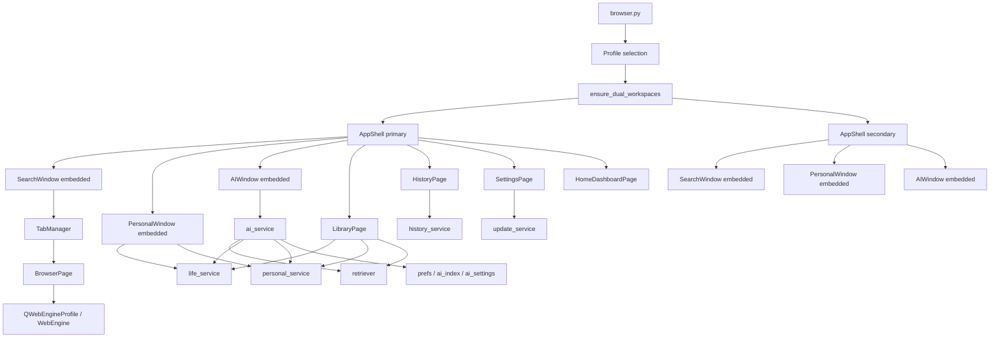
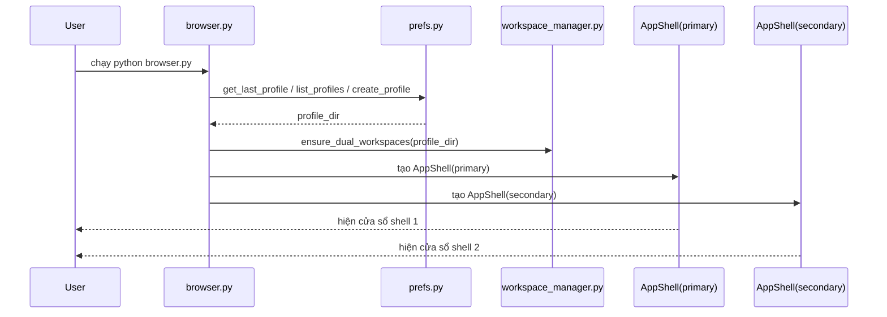
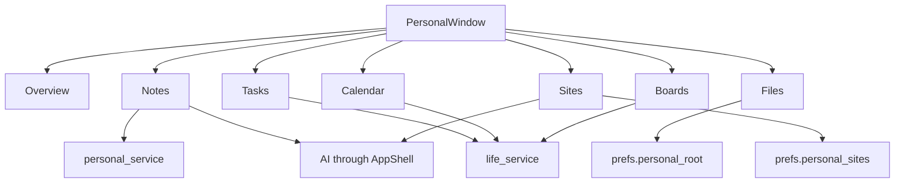
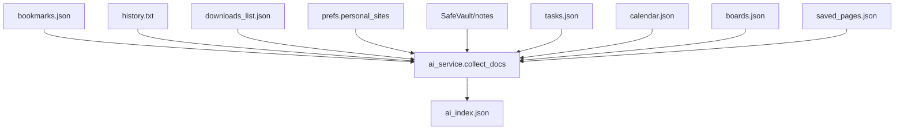
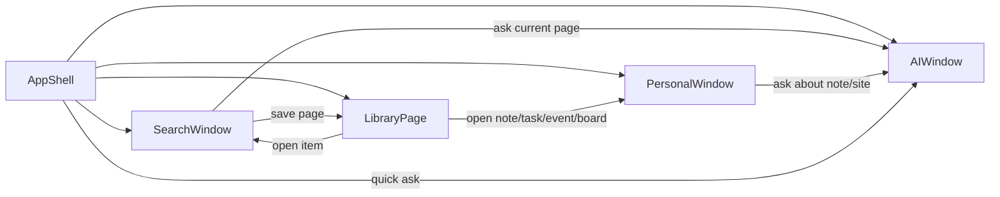
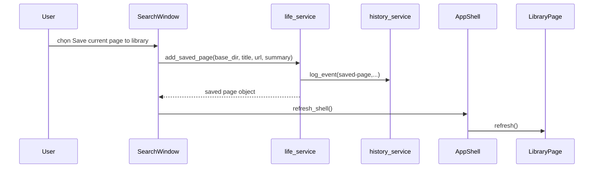
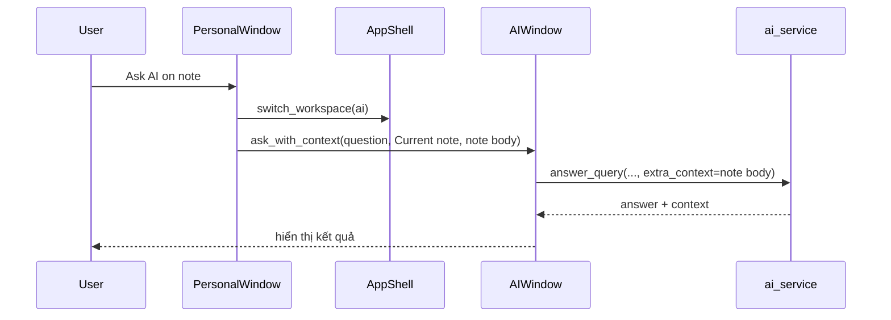
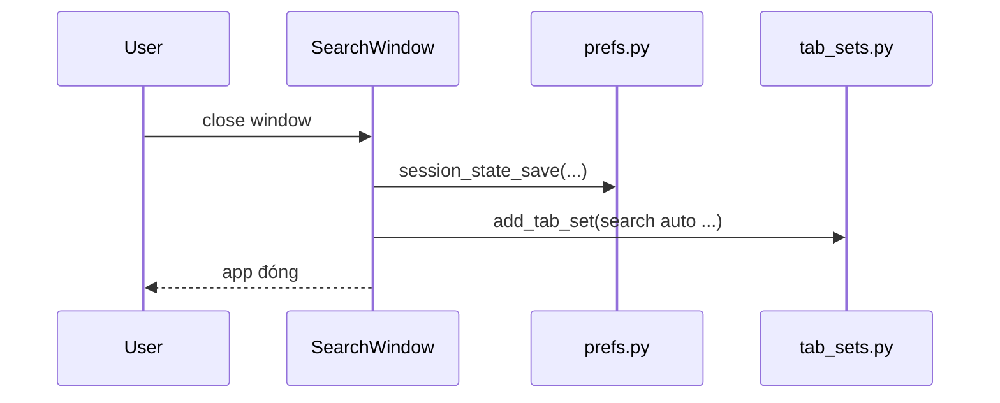

# LiteBrowser 3.0 - Báo cáo cực chi tiết về tính năng, kiến trúc, liên kết module và luồng dữ liệu

> ⚠️ **Tài liệu legacy (thời kỳ 3.0, viết 2026-04-07)** — thông tin có thể lỗi thời so với code hiện tại (bản **6.2.0**, shell đa workspace + shim PyQt5/PyQt6). **Tài liệu hiện hành: `README.md`, `RUN_AND_BUILD.md`, `ARCHITECTURE.md`.**

## 1. Phạm vi báo cáo

Tài liệu này được viết bằng cách đọc trực tiếp code hiện có trong workspace `D:\Code folder\new browser` vào ngày `2026-04-07`, không chỉ dựa trên `README.md` hay các tài liệu overview cũ.

Mục tiêu của báo cáo:

- Liệt kê và giải thích toàn bộ tính năng đang tồn tại trong code.
- Chỉ rõ file nào chịu trách nhiệm cho tính năng nào.
- Mô tả dữ liệu nào được lưu ở đâu, định dạng gì, ai đọc và ai ghi.
- Mô tả cách các cửa sổ, service và helper liên kết với nhau.
- Vẽ graph Mermaid để nhìn ra kiến trúc tổng thể và đường đi của dữ liệu.
- Ghi rõ các chi tiết nhỏ dễ bị bỏ sót: timer, metadata tab, cache favicon, tab sleeping, backup/import, update flow, quyền site, sync-ready state, prompt history, board strokes, profile layout, workspace dual-window.

Lưu ý thực tế:

- Cụm từ "không bỏ qua gì hết" ở mức tuyệt đối là gần như không thể nếu hiểu theo từng dòng lệnh nhỏ, từng style token, từng màu QSS. Vì vậy tài liệu này cố gắng bao phủ toàn bộ hành vi chức năng, cấu trúc dữ liệu, quan hệ module và luồng xử lý quan trọng trong code hiện tại.
- Báo cáo này phản ánh trạng thái code hiện tại trong repo, không phải trạng thái mô tả trong các file tài liệu cũ nếu chúng khác với code.

---

## 2. Tổng quan hệ thống

LiteBrowser hiện tại không còn là một cửa sổ browser đơn thuần. Nó là một shell đa không gian làm việc gồm:

- `Browser` cho duyệt web và quản lý tab.
- `Personal Hub` cho notes, tasks, calendar, boards, personal sites và files.
- `AI Workspace` cho retrieval và hỏi đáp AI dựa trên dữ liệu profile.
- `Library` để hợp nhất tìm kiếm nhiều loại dữ liệu.
- `History` để xem activity log cấp profile và backup/import.
- `Settings` để quản lý giao diện, sync-ready state và update.

Ngoài ra app còn chạy đồng thời hai cửa sổ shell chính, tương ứng hai browser workspace cố định.

### Graph tổng thể

### Các tầng chính

1. Tầng entry/runtime
- `browser.py`
- `app_paths.py`
- `prefs.py`

2. Tầng shell/UI tổng
- `app_shell.py`
- `theme.py`
- `win_titlebar.py`

3. Tầng browser
- `main_window.py`
- `tab_manager.py`
- `browser_page.py`
- `adblock.py`
- `download_mgr.py`
- `dialogs.py`
- `new_tab_page.py`
- `vault_ui.py`

4. Tầng personal/productivity
- `personal_window.py`
- `personal_service.py`
- `life_service.py`

5. Tầng AI / retrieval
- `ai_window.py`
- `ai_service.py`
- `retriever.py`

6. Tầng history/backup/update/security
- `history_service.py`
- `update_service.py`
- `security.py`
- `password_manager.py`
- `tab_sets.py`
- `workspace_manager.py`

## 3. Luồng khởi động chi tiết

### 3.1 Những gì `browser.py` làm

`browser.py` là entry point chính và thực hiện các việc sau:

1. Ép Qt chạy theo hướng software rendering.
2. Chèn Chromium flags giảm phụ thuộc GPU và tinh chỉnh WebEngine runtime.
3. Khởi tạo `QApplication`, app name, version, icon và font.
4. Xác định profile đang dùng.
5. Gọi `workspace_manager.ensure_dual_workspaces(profile_dir)`.
6. Dọn một số thư mục cache GPU cũ trong `BrowserData`.
7. Tạo **hai** instance `AppShell`.
8. Show cả hai cửa sổ.

### 3.2 Logic chọn profile

Luồng `_get_profile_dir(app_dir)`:

- Nếu có `last_profile.txt` và profile còn tồn tại, dùng lại.
- Nếu chưa có profile, tạo `Default`.
- Nếu có nhiều profile nhưng chưa chốt, mở `show_profiles_dialog`.
- Sau đó gọi `prefs.ensure_profile_layout(profile_dir)`.

### 3.3 Graph khởi động

## 4. Mô hình cửa sổ và không gian làm việc

### 4.1 AppShell là shell trung tâm

`AppShell` là QMainWindow lớn nhất và đóng vai trò như “hệ điều hành mini” của LiteBrowser.

Nó chứa:

- Left rail điều hướng.
- Center stack chứa các workspace page.
- Status strip ở dưới cùng của phần center.
- Insights panel ở cạnh phải.
- Omnibar điều khiển nhanh.

### 4.2 Các workspace trong AppShell

`workspace_index` của `AppShell` gồm:

- `home`
- `browser`
- `history`
- `ai`
- `personal`
- `library`
- `settings`

### 4.3 Hai cửa sổ shell chạy song song

Điểm rất quan trọng:

- App hiện tạo hai shell cùng lúc.
- Mỗi shell nhúng một `SearchWindow` riêng.
- Mỗi shell browser được gắn với một `browser_workspace_id` riêng.
- Điều này tạo ra 2 vùng browser song song ở cấp ứng dụng.

### 4.4 Restore vị trí cửa sổ

`AppShell` lưu/restore geometry riêng cho:

- `shell_window_primary`
- `shell_window_secondary`

trong `prefs.json`.

Nếu chưa có, nó chia màn hình làm hai nửa:

- primary ở nửa trái
- secondary ở nửa phải

## 5. Cấu trúc dữ liệu trên đĩa

Mọi dữ liệu chính được neo quanh `base_dir` của profile.

### Graph thư mục

```mermaid
graph TD
    P[profiles/Default or other profile] --> P1[prefs.json]
    P --> P2[profile_meta.json]
    P --> P3[session.json]
    P --> P4[history.txt]
    P --> P5[bookmarks.json]
    P --> P6[workspaces.json]
    P --> P7[permissions.json]
    P --> P8[downloads_list.json]
    P --> P9[proxy_config.json]
    P --> P10[activity_history.json]
    P --> P11[tab_sets.json]
    P --> P12[tasks.json]
    P --> P13[calendar.json]
    P --> P14[boards.json]
    P --> P15[saved_pages.json]
    P --> P16[sync_state.json]
    P --> P17[sync_account.json]
    P --> P18[ai_index.json]
    P --> P19[ai_settings.json]
    P --> P20[SafeVault]
    P --> P21[Extensions]
    P --> P22[favicons]
    P --> P23[BrowserData]
    P --> P24[Downloads]
```

### Ý nghĩa từng file/thư mục chính

- `prefs.json`: flags, startup mode, dark web, hibernate time, passcode, theme, shell geometry, personal root, personal sites, privacy flags.
- `profile_meta.json`: schema version.
- `session.json`: session version 2, tabs và recently_closed.
- `history.txt`: browser URL history dạng timestamp-tab-url.
- `bookmarks.json`: bookmark list.
- `workspaces.json`: browser workspace list + current id.
- `permissions.json`: allow/deny theo origin và feature.
- `downloads_list.json`: lịch sử download.
- `activity_history.json`: activity log hợp nhất.
- `tab_sets.json`: snapshot các phiên Search/Personal/AI.
- `tasks.json`, `calendar.json`, `boards.json`, `saved_pages.json`: dữ liệu Personal và Library.
- `sync_state.json`, `sync_account.json`: trạng thái sync-ready.
- `ai_index.json`, `ai_settings.json`: retrieval index và settings provider.
- `SafeVault/`: notes, password store, file riêng.
- `Extensions/`: userscript JS.
- `favicons/`: cache icon website.
- `BrowserData/`: persistent storage của Qt WebEngine.

## 6. Hệ profile

Profile là lớp cách ly dữ liệu cao nhất trong app.

Mỗi profile tách riêng:

- browser data
- bookmarks
- history
- downloads
- notes
- tasks
- calendar
- boards
- saved pages
- ai index/settings
- passcode
- workspaces

### Thao tác profile hỗ trợ

- list profile
- create profile
- delete profile
- set last profile
- chọn profile qua dialog

## 7. Workspace browser

Có hai loại “workspace” khác nhau:

1. Browser workspace: nhóm tab trong SearchWindow.
2. App shell workspace: page trong `AppShell`.

### Browser workspace trong `workspace_manager.py`

`workspace_manager` thao tác trên `workspaces.json`:

- `load`
- `save`
- `get_workspaces_list`
- `get_current_id`
- `set_current_id`
- `add_workspace`
- `remove_workspace`
- `rename_workspace`
- `ensure_dual_workspaces`

### Liên hệ giữa browser workspace và 2 shell window

Mỗi `AppShell` khi tạo `SearchWindow` embedded sẽ gọi:

- `set_workspace_id(self.browser_workspace_id, persist=False)`

Nghĩa là:

- shell primary xem một workspace browser cố định.
- shell secondary xem workspace browser cố định còn lại.

## 8. SearchWindow: browser chính

`SearchWindow` là cửa sổ browser đầy đủ nhất. Nó có thể chạy độc lập hoặc embedded trong `AppShell`.

### 8.1 Cấu trúc layout

- `QSplitter` ngang
- trái là sidebar
- phải là content area

Sidebar gồm:

- header có nút collapse
- label tab counter
- combo workspace
- thanh chuyển panel
- `QStackedWidget` cho 4 panel
- nút `+ New Tab`
- nút `Control` mở options menu

Content area gồm:

- top bar
- inline AI panel
- web container với `QStackedWidget`

### 8.2 4 panel sidebar

1. `Tabs`
2. `Star`
3. `Past`
4. `Down`

### 8.3 Top bar

Các control:

- Back
- Forward
- Reload
- Home
- Search engine combo
- Site state label
- URL bar
- Go
- AI
- Page menu
- Zoom out
- Zoom label
- Zoom in
- Find
- Read
- Save
- Dev

### 8.4 Keyboard shortcuts trong SearchWindow

- `Ctrl+T`
- `Ctrl+Shift+N`
- `Ctrl+Shift+E`
- `Ctrl+S`
- `Ctrl+W`
- `F5`, `Ctrl+R`
- `Ctrl+F`
- `Ctrl+H`
- `Ctrl+J`
- `Ctrl+L`
- `Ctrl+D`
- `Alt+Left`, `Alt+Right`
- `F11`
- `Ctrl+Shift+D`
- `Ctrl+Shift+K`

### 8.5 Options menu

Menu chia làm các cụm:

- tổng quát
- phiên & không gian
- đọc & lưu
- riêng tư & hiệu năng
- dữ liệu & công cụ

### 8.6 Page menu

Tập trung vào page hiện tại:

- bookmark
- find in page
- reader mode
- open externally
- zoom
- developer tools
- more browser options

## 9. TabManager: trái tim của browser tab

`tab_manager.py` là nơi xử lý tab-level behavior thực tế.

### 9.1 Roles và metadata

Mỗi item trong `QListWidget` tab mang các role:

- `TAB_WIDGET_ROLE`
- `TAB_PINNED_ROLE`
- `TAB_META_ROLE`
- workspace role

`TAB_META_ROLE` chứa dict:

- `title`
- `url`
- `icon`
- `hibernated`

### 9.2 TabListItemWidget

Mỗi row tab có:

- icon label
- title label
- state label
- close button

Chi tiết nhỏ:

- hover 3 giây sẽ show tooltip memory
- state label hiển thị `Zz` khi hibernated
- close button có style riêng

### 9.3 Add tab

`add_tab(...)` xử lý nhiều case:

- tab mới thường
- tab incognito
- tab restore từ session
- tab restore từ tab set
- new tab page
- deferred loading bằng `pending_url`
- hibernated tab từ đầu nếu số tab quá ngưỡng

### 9.4 Cơ chế pending_url

Điểm rất quan trọng:

- nhiều tab không load URL ngay
- URL thật được giữ trong property `pending_url`
- khi user chuyển sang tab đó, `change_tab()` mới setUrl

Lợi ích:

- giảm tải startup
- hỗ trợ hibernate/restore
- cho phép mở nhiều tab saved state mà không bắn request đồng loạt

### 9.5 Hibernation

Có 2 cơ chế ngủ tab:

1. Timer hibernate theo `hibernate_seconds`
2. Background hibernation do số lượng tab lớn hơn threshold

`AUTO_HIBERNATE_THRESHOLD = 10`

Khi hibernate:

- tab hiện tại không bị ngủ
- URL hiện tại được lưu vào metadata và `pending_url`
- browser chuyển sang `about:blank`
- property `hibernated=True`
- UI gắn `Zz`

Khi user quay lại tab:

- `change_tab()` phát hiện `pending_url`
- load lại URL thật
- clear `hibernated`

### 9.6 Đếm tab Active/Hibernate

`update_tab_count()` chỉ tính tab thuộc workspace browser hiện tại.

### 9.7 Favicon cache

`_favicon_path_for_url(url)`:

- hash SHA1 URL
- lưu PNG vào `favicons/<sha1>.png`

Khi iconChanged:

- nếu icon hợp lệ, TabManager lưu icon file ra đĩa
- metadata tab lưu path icon

### 9.8 Context menu tab

Trong `SearchWindow.show_tab_context_menu()`:

- bật/tắt mute
- auto reload 10s
- pin/unpin
- duplicate
- close

### 9.9 Optimize memory

`optimize_memory()` gọi hibernate hàng loạt các tab không active.

SearchWindow expose hành vi này qua menu:

- `Đóng băng toàn bộ`

## 10. BrowserPage: quyền site và pop-up window

`BrowserPage` kế thừa `QWebEnginePage`.

### 10.1 Xử lý createWindow

Khi trang web yêu cầu mở cửa sổ mới:

- BrowserPage gọi host `tab_manager.add_tab(...)`
- page mới được mở thành tab mới

### 10.2 Xử lý permission

Khi website yêu cầu:

- geolocation
- microphone
- camera
- microphone+camera
- desktop capture
- notifications

thì BrowserPage:

1. map feature sang tên text
2. đọc `permissions.json`
3. nếu đã có policy thì apply thẳng
4. nếu chưa có, hiện QMessageBox

### 10.3 JavaScript console noise filtering

`javaScriptConsoleMessage(...)` bỏ qua một số warning ồn:

- mixed content
- unrecognized feature
- samesite
- chromestatus feature warnings
- insecure image

Chỉ in ra console nếu set env:

- `LITEBROWSER_DEBUG_JS`

## 11. Web profile, privacy, network và rendering

### 11.1 SearchWindow cấu hình `QWebEngineProfile`

`_configure_web_profile(profile, off_the_record=False)` thiết lập:

- user agent Chrome-like
- accept-language `en-US,en;q=0.9`
- downloadRequested -> `handle_download_request`

Nếu off-the-record:

- no persistent cookies
- memory http cache

Nếu profile thường:

- persistent storage path = `BrowserData`
- cache path = `BrowserData/Cache`
- force persistent cookies

### 11.2 Security-ish flags ở WebEngineSettings

Code bật/tắt:

- `XSSAuditingEnabled = True`
- `JavascriptCanOpenWindows = True`
- `LocalContentCanAccessRemoteUrls = False`
- `LocalContentCanAccessFileUrls = False`
- `PluginsEnabled = False`
- `ScrollAnimatorEnabled = True`
- `AutoLoadImages = True`
- `PlaybackRequiresUserGesture = False` nếu có

### 11.3 Proxy

SearchWindow:

- đọc `proxy_config.json`
- gọi `_apply_saved_proxy()`
- `_set_proxy_from_config(cfg)` dùng `QNetworkProxy.setApplicationProxy`

Hỗ trợ:

- HTTP proxy
- SOCKS5 proxy
- username/password nếu có

### 11.4 Third-party cookies

Có cờ preference:

- `block_third_party_cookies`

SearchWindow cố gắng áp dụng filter nếu Qt runtime hỗ trợ API phù hợp.

### 11.5 Compatibility hosts

`COMPATIBILITY_HOSTS` gồm:

- `claude.ai`
- `chatgpt.com`
- `copilot.microsoft.com`
- `gemini.google.com`
- `perplexity.ai`

## 12. History, recently closed, bookmark, session

### 12.1 Browser history thô

Browser visit được ghi vào `history.txt`.

### 12.2 Activity history hợp nhất

`history_service.py` tạo một lớp log khác cho:

- notes
- tasks
- calendar
- boards
- board-note
- saved-page
- download
- ai-question
- account

Mỗi event có:

- `id`
- `ts`
- `kind`
- `title`
- `detail`
- `meta`

### 12.3 Recently closed trong session

`session.json` version 2 lưu thêm:

- `recently_closed`

History panel trong sidebar hiển thị trước:

- recently closed windows
- recently closed tabs

rồi mới đến history URL bình thường.

### 12.4 Session restore

Startup modes:

- `restore`
- `newtab`
- `home`

### 12.5 Bookmark

Bookmark được:

- lưu qua `Ctrl+D`
- xem qua dialog
- xem ở sidebar panel Star
- import/export qua dialog

### 12.6 Quick Switcher

Quick Switcher trộn các nguồn:

- tab hiện tại
- bookmarks
- history

## 13. Download system

### 13.1 `download_mgr.py`

Chức năng:

- load list
- save list
- add download
- update status
- remove download
- xác định download dir

### 13.2 Download request flow

`SearchWindow.handle_download_request(download)`:

1. Nhận request download từ WebEngine profile.
2. Có thể hiện xác nhận, cảnh báo cho file nhạy cảm.
3. Cho user chọn path save.
4. Ghi item vào `downloads_list.json`.
5. Khi tải xong, `_finalize_download(...)` cập nhật status.

### 13.3 Download UI

Có 2 nơi hiển thị:

- sidebar panel `Down`
- `show_downloads_dialog`

Actions hỗ trợ:

- open file
- open containing folder
- remove item khỏi list

## 14. Extensions JS

LiteBrowser không dùng extension `.crx` kiểu Chrome.

Nó dùng:

- thư mục `Extensions/`
- file `.js`
- metadata bật/tắt

Khi trang load xong:

- SearchWindow inject các script JS đang bật vào page.

`show_extensions_dialog(parent)` cho phép:

- liệt kê `.js`
- bật/tắt
- lưu trạng thái
- tạo file mẫu adblock đơn giản

## 15. New Tab page

`new_tab_page.build_new_tab_html(base_dir)` tạo HTML cho `about:newtab`.

Thành phần của New Tab:

- speed dial links từ bookmark/history
- search box
- recent items

Nguồn dữ liệu:

- `prefs.load_bookmarks(base_dir)`
- `prefs.load_history_entries(base_dir)`

## 16. Reader mode, dark web, page tools

### 16.1 Reader mode

`toggle_reader_mode()` inject JS để strip bớt thành phần nhiễu:

- header
- footer
- nav
- sidebars
- ads-like blocks

### 16.2 Force dark web

`toggle_dark_web()` dùng JS/CSS inject filter kiểu invert/hue transform.

State lưu ở:

- `prefs.force_dark_web`

### 16.3 Các công cụ khác

- `find_text()`
- `print_page()`
- `save_page_pdf()`
- `capture_screenshot()`
- `extract_text()`
- `open_current_in_external_browser()`
- `show_dev_tools()`

## 17. Password manager và khóa profile

Có 2 lớp bảo vệ khác nhau:

1. `security.py` dùng passcode để khóa Personal/AI.
2. `password_manager.py` dùng master password để mã hóa password website.

### 17.1 `security.py`

Mục tiêu:

- khóa truy cập `Personal` và `AI`
- cho phép nhớ unlock trong phiên

Dữ liệu lưu trong `prefs.json`:

- `passcode_salt`
- `passcode_hash`
- `passcode_rounds`

### 17.2 `password_manager.py`

Mục tiêu:

- lưu credential website
- autofill form

Dữ liệu lưu:

- `SafeVault/passwords.enc`

Cơ chế:

- derive key từ master password
- encrypt bằng Fernet

## 18. Adblock, HTTPS-only, request interception

`adblock.py` chứa `TrackingBlocker`, kế thừa `QWebEngineUrlRequestInterceptor`.

### 18.1 Việc interceptor làm

- set DNT-like behavior qua request handling
- chặn tracker domain mặc định
- chặn theo file filter user cung cấp
- chặn HTTP khi HTTPS-only bật

### 18.2 Trusted challenge domains

Code có khái niệm trusted challenge domains để không phá các trang challenge/captcha quá mức.

### 18.3 Filter file

User có thể chọn file filter qua privacy dialog.

Parser hỗ trợ dạng:

- `||domain^`
- domain plain text

### 18.4 HTTPS-only

Khi bật:

- request `http://` thường bị block
- ngoại lệ cho localhost / 127.0.0.1

## 19. SafeVault

SafeVault là vùng lưu trữ local dành cho dữ liệu nhạy/cá nhân.

### Chứa gì

- notes
- password store encrypted
- file user upload qua vault UI

### `vault_ui.py`

Cho phép:

- duyệt thư mục
- tạo thư mục
- tạo note text
- upload file
- delete
- đi lên thư mục cha
- mở thư mục bằng Explorer

## 20. Personal Hub chi tiết

`PersonalWindow` là workspace lớn cho dữ liệu cá nhân.

Nó có 7 page:

- Overview
- Notes
- Tasks
- Calendar
- Boards
- Files
- Sites

### Graph Personal Hub

### 20.1 Overview

Hiển thị snapshot nhanh:

- pending tasks
- upcoming events
- boards total
- notes total

### 20.2 Notes

Nguồn dữ liệu:

- file `.md` / `.txt` trong `SafeVault/notes`

Chức năng:

- search note
- chọn cỡ font editor
- tạo note
- xóa note
- save note
- hỏi AI về note hiện tại

### 20.3 Tasks

Dữ liệu mỗi task:

- `id`
- `title`
- `bucket`
- `completed`
- `due_at`
- `workspace_id`
- `created_at`
- `updated_at`
- `sync_state`
- `archived`

Chức năng:

- add task
- toggle done
- delete task

### 20.4 Calendar

Dữ liệu event:

- `id`
- `title`
- `starts_at`
- `bucket`
- `workspace_id`
- `created_at`
- `updated_at`
- `sync_state`
- `archived`

Chức năng:

- add event
- remove event
- jump to today
- select event

### 20.5 Boards

Đây là một whiteboard mini.

Thành phần:

- danh sách board bên trái
- canvas `QGraphicsScene`
- `BoardView` để pan/zoom/draw
- sticky cards
- freehand ink strokes

Data board:

- `id`
- `title`
- `nodes`
- `edges`
- `strokes`
- timestamps
- sync/local flags

### 20.6 Files

Nguồn dữ liệu:

- `prefs.personal_root`

Chức năng:

- chọn personal root folder
- liệt kê file/thư mục
- mở file/folder bằng `os.startfile`

### 20.7 Sites

Nguồn dữ liệu:

- `prefs.personal_sites`

Chức năng:

- add site
- remove site
- preview site trong `QWebEngineView`
- open site in browser workspace
- ask AI about selected site

## 21. `life_service.py`: lớp dữ liệu productivity

`life_service` là service cho:

- tasks
- calendar
- boards
- saved pages
- sync state/account
- dashboard snapshot
- search everything

Hầu hết thay đổi đều:

1. load file json
2. chỉnh list/object
3. save lại
4. `_touch_sync_state()`
5. `history_service.log_event(...)`

### 21.1 Saved pages

Fields:

- `id`
- `title`
- `url`
- `summary`
- timestamps
- workspace/sync flags

Nếu URL đã tồn tại:

- không tạo item mới
- mà update item cũ

### 21.2 Sync-ready state

Đây không phải cloud sync hoàn chỉnh.

Nó là “sync-ready profile state”:

- có account local
- có `pending_changes`
- có `last_sync_at`
- có `mode=local-cache`

### 21.3 `search_everything`

Search đơn giản nhưng quan trọng cho Library:

- quét tasks
- events
- boards
- board node title/payload
- saved pages

## 22. `personal_service.py`: notes và personal root

Notes là file-based storage, không phải database.

Ưu điểm:

- dễ backup
- dễ đọc bằng editor ngoài
- đơn giản

`list_notes(base_dir, query)` tìm trên:

- filename/title
- toàn bộ content

`list_root_entries(base_dir, query)` phục vụ page Files:

- đọc `personal_root`
- trả list file/dir
- giới hạn 1000 item

## 23. AI Workspace chi tiết

`AIWindow` là nơi hợp nhất retrieval + provider selection + prompt session.

### 23.1 Các provider hỗ trợ

UI cho phép chọn:

- `RAG local only`
- `OpenRouter assistant`
- `Local LLM: Ollama`
- `Local LLM: llama.cpp server`

### 23.2 Cấu trúc giao diện

Hero area có:

- provider combo
- model field
- API key field
- save AI settings
- question input
- ask button
- reindex button
- index label
- context scope label
- show sources checkbox
- save answer to note
- create task from answer
- save session

3 cột nội dung:

1. Sessions
2. Assistant thread
3. Sources & prompts

### 23.3 Prompt Library

Prompt template mặc định:

- Summarize this workspace
- Turn current page into a note
- Extract deadlines and tasks
- Build a study brief
- What changed in my recent saved pages?
- What should I focus on today?

### 23.4 Session history nội bộ

AIWindow giữ:

- `_thread_items`
- `_prompt_history`

Giới hạn:

- thread items tối đa 24
- prompt history tối đa 20

### 23.5 Save AI answer

Hỗ trợ:

- save answer thành note
- create task từ câu hỏi hiện tại

### 23.6 AI session snapshots

AIWindow có `get_current_ai_state()` trả list fake tabs:

- `url = ai://prompt/<n>`
- `prompt`
- `active`

## 24. `ai_service.py`: retrieval và provider routing

### 24.1 Mô hình dữ liệu `AIDoc`

Mỗi document index gồm:

- `source`
- `title`
- `url`
- `snippet`
- `meta`

### 24.2 Nguồn dữ liệu được index

`collect_docs(base_dir)` lấy từ:

- bookmarks
- history
- downloads
- personal sites
- notes trong SafeVault
- tasks
- calendar events
- boards
- board notes
- saved pages

### Graph AI index sources

### 24.3 rebuild/load/index

- `rebuild_index`: build lại toàn bộ rồi ghi `ai_index.json`
- `load_index`: đọc index cũ
- `index_docs`: nếu thiếu docs thì rebuild lại

### 24.4 Provider calls

#### OpenRouter
- dùng API key
- default model `openai/gpt-4o-mini`

#### Ollama
- detect model qua `ollama list`
- run qua `ollama run <model>`

#### llama.cpp
- gọi HTTP endpoint local

#### Fallback
- dùng `retriever.rule_based_answer(question, results)` nếu provider không trả lời được

### 24.5 `build_context`

Tạo context text gồm:

- optional `extra_context`
- top_k retriever results
- source
- title
- URL
- snippet
- score

### 24.6 `answer_query`

Luồng:

1. load settings
2. build context
3. tạo prompt chung
4. route theo provider
5. nếu fail thì fallback rule-based
6. trả `provider`, `answer`, `context`, `results`

## 25. LibraryPage

Library là chỗ hợp nhất search đa nguồn.

### 25.1 Nếu có query

Nó gộp:

- `life_service.search_everything(...)`
- `retriever.search(...)`

Sau đó map lại kind:

- `vault_note` -> `note`
- `task` -> `task`
- `calendar` -> `event`
- `board` -> `board`
- `board_note` -> `board-node`
- `saved_page` -> `saved-page`

### 25.2 Nếu không có query

Hiển thị mặc định:

- saved pages gần đây
- notes
- tasks

### 25.3 Open item

Double-click item sẽ gọi `shell.open_library_item(data)`.

## 26. HistoryPage và backup/import

HistoryPage trong shell là **activity center**.

### 26.1 Filter

Cho phép lọc theo `kind`:

- all
- browser-visit
- bookmark
- note
- task
- calendar
- board
- download
- saved-page
- ai-question
- account

### 26.2 Search

Query match trên:

- kind
- title
- detail
- meta fields

### 26.3 Export backup

`history_service.export_profile_payload(base_dir)` đóng gói:

- profile_meta
- prefs
- history_entries
- bookmarks
- session
- workspaces
- permissions
- downloads
- tab_sets
- tasks
- calendar
- boards
- saved_pages
- sync_state
- sync_account
- ai_settings
- ai_index
- activity_history
- notes

### 26.4 Import backup

`import_profile_payload(...)` restore lại gần như toàn bộ.

Chi tiết đáng chú ý:

- notes dir hiện tại bị xóa file cũ trước khi import notes mới
- nhiều file JSON được overwrite trực tiếp

## 27. SettingsPage

Settings & Sync Center xử lý 4 mảng lớn:

1. Account
2. Interface
3. Guided start
4. App updates

### 27.1 Account

Fields:

- display name
- email
- enable sync-ready profile state

### 27.2 Interface

Cho phép chỉnh:

- density: `compact`, `comfortable`, `tablet`
- theme: `cafe-night`, `cafe-day`

### 27.3 Guided start

Nút:

- open guide
- open browser control center

### 27.4 App updates

Nút:

- check for updates
- download and install update
- open release page

## 28. Update system

`update_service.py` là service update từ remote metadata JSON.

### 28.1 `UpdateInfo`

Fields:

- `current_version`
- `latest_version`
- `download_url`
- `notes`
- `published_at`
- `has_update`

### 28.2 Check update

`check_for_updates(metadata_url=None)`:

- đọc JSON từ `app_version.UPDATE_METADATA_URL`
- parse version/download_url/notes/date
- so sánh version tuple

### 28.3 Download update

`download_update_package(...)`:

- tải `.exe` về temp dir

### 28.4 Install update

Nếu app đang là bản PyInstaller/frozen:

- tạo file `apply_update.cmd` tạm
- script chờ process hiện tại thoát
- copy file exe mới đè file cũ
- start exe mới

Nếu app đang chạy bằng Python source:

- không auto replace
- chỉ hướng user sang release page

### 28.5 Update flow trong AppShell

AppShell:

- check update bằng `ThreadPoolExecutor(max_workers=1)`
- UI không block
- callback quay lại main thread bằng `QTimer.singleShot(0, ...)`

## 29. Omnibar trong AppShell

`AppShell.omnibar` có placeholder:

`Search everything, open a URL, or type commands like /task, /note, /browser`

Nghĩa là omnibar là command palette đơn giản.

Các hành vi chính:

- mở URL trực tiếp
- chuyển workspace
- tạo task
- tạo note
- gọi guide
- hỏi AI
- tìm trong library/global data

## 30. Ambient Insights

Insights panel bên phải của AppShell gồm:

- danh sách gợi ý nhanh
- sleeping tabs card
- assistant quick box

### 30.1 Suggestions

Ví dụ gợi ý từ `_refresh_insights()`:

- số pending tasks
- số upcoming events
- số saved pages
- command mẫu `/task`
- command mẫu `/note`
- `/guide`
- `/ask`

### 30.2 Sleeping tabs

Browser gửi title các tab ngủ về shell qua `set_sleeping_tabs(titles)`.

### 30.3 Assistant quick box

Cho phép hỏi AI nhanh theo:

- current scope
- whole profile

## 31. Tab sets / listtab

`tab_sets.py` quản lý snapshot các phiên làm việc.

### Mỗi set có

- `id`
- `kind` (`search`, `personal`, `ai`)
- `title`
- `tabs`
- `created_at`

### 31.1 SearchWindow tab set

`get_current_tab_state()` trả data cho từng tab:

- url
- title
- icon
- hibernated
- active
- pinned
- workspace

`closeEvent()` auto save set.

### 31.2 PersonalWindow tab set

Personal không có “tab” thật, nhưng mô hình hóa state hiện tại thành set để snapshot phiên làm việc.

### 31.3 AIWindow tab set

AI snapshot prompt history thành set.

### 31.4 Tab sets (lịch sử bộ tab)

`launcher_window.py` đã được gỡ. Dữ liệu tab sets vẫn do [`tab_sets.py`](D:\Code folder\new browser\tab_sets.py) lưu; UI liên quan nằm trong shell/dialogs khi cần.

## 32. AppShell (entry shell)

Luồng chính: [`browser.py`](D:\Code folder\new browser\browser.py) tạo một hoặc hai `AppShell`, mỗi shell nhúng Search / Personal / AI và các trang Library, History, Settings.

## 33. AppShell và SearchWindow liên kết với nhau như thế nào

Đây là mối nối quan trọng nhất trong app.

### 33.1 Browser embedded

AppShell tạo:

- `self.browser_page = SearchWindow(..., embedded=True)`

### 33.2 Browser gọi ngược về shell

SearchWindow có `_host_shell()` để tìm shell cha.

Nó dùng việc này cho các tính năng như:

- hỏi AI về current page
- save current page vào library rồi refresh shell
- cập nhật insights/sleeping tabs
- mở update check từ browser options

### 33.3 Personal và AI cũng gọi ngược shell

PersonalWindow có `_host_shell()` để:

- gửi note/site sang AI
- chuyển workspace shell

### Graph liên kết chéo

## 34. HomeDashboardPage

Home page trong shell là một dashboard mềm hơn.

### Thành phần

- hero card
- 5 action buttons:
  - Open Browser
  - Ask AI
  - Open Personal
  - Quick Task
  - Guide
- stats row:
  - pending tasks
  - upcoming events
  - saved pages
  - boards
- recent notes
- today focus

## 35. Theme system

`theme.py` cung cấp QSS và palette cho app.

### Các mode đang thấy trong UI

- `cafe-night`
- `cafe-day`

### Nơi dùng

- AppShell
- SearchWindow
- PersonalWindow
- AIWindow
- LauncherWindow
- dialogs

## 36. Dữ liệu nào ghi activity log

Rất nhiều hành động gọi `history_service.log_event`.

Bao gồm:

- tạo/sửa/xóa note
- add/toggle/remove task
- add/remove event
- create/update/remove board
- add board sticky
- save/update saved page
- save sync account
- AI question

## 37. Những chi tiết nhỏ nhưng quan trọng

### 37.1 Two-level storage history

App có cả:

- browser URL history thô (`history.txt`)
- activity history semantic (`activity_history.json`)

### 37.2 Browser embedded vs standalone

SearchWindow, PersonalWindow, AIWindow đều có flag:

- `embedded`

### 37.3 Profile layout đảm bảo trước khi dùng

Hầu hết module đều gọi:

- `prefs.ensure_profile_layout(base_dir)`

### 37.4 AI index không phụ thuộc provider

Kể cả khi không có OpenRouter/Ollama/llama.cpp:

- AI Workspace vẫn hoạt động ở chế độ local retrieval + rule-based answer

### 37.5 Off-the-record tab

Incognito tab vẫn sống trong tab stack chung nhưng dùng profile off-the-record.

### 37.6 BrowserData cleanup

`browser.py` xóa vài GPU cache dir cũ mỗi lần startup.

### 37.7 Update check chỉ auto startup trên primary shell

Điều này tránh check update hai lần vì app có 2 shell.

### 37.8 Library search là hybrid

Nó không chỉ dùng substring search nội bộ mà còn dùng retriever search có score.

### 37.9 Board schema có `edges`

Nhưng UI hiện chưa khai thác mạnh `edges`.

### 37.10 Shell sync chỉ là local sync-ready

Không có cloud sync thật trong code hiện tại.

## 38. Quan hệ file -> trách nhiệm

| File | Trách nhiệm chính |
|---|---|
| `browser.py` | entry, chọn profile, tạo 2 AppShell |
| `app_shell.py` | shell đa workspace, omnibar, insights, update orchestration |
| `main_window.py` | browser UI, tab/sidebar/topbar, page actions |
| `tab_manager.py` | vòng đời tab, hibernate, favicon cache |
| `browser_page.py` | permissions và popup tab creation |
| `adblock.py` | request interceptor, tracker block, https-only |
| `dialogs.py` | toàn bộ dialog workflow browser/profile/privacy/tool |
| `new_tab_page.py` | HTML tab mới |
| `vault_ui.py` | file browser cho SafeVault |
| `prefs.py` | path helpers + persistence low-level |
| `workspace_manager.py` | browser workspaces |
| `tab_sets.py` | snapshot session/search/personal/ai |
| `personal_window.py` | Personal Hub UI |
| `personal_service.py` | notes và personal root/file listing |
| `life_service.py` | tasks/events/boards/saved_pages/sync state |
| `ai_window.py` | AI UI và session prompt |
| `ai_service.py` | index, context build, provider calls |
| `history_service.py` | activity log + export/import backup |
| `security.py` | passcode gate cho Personal/AI |
| `password_manager.py` | encrypted credentials store |
| `download_mgr.py` | download list persistence |
| `update_service.py` | update metadata/download/install |
| `theme.py` | QSS/palette |

## 39. Luồng dữ liệu end-to-end mẫu

### 39.1 User lưu một trang web vào Library

### 39.2 User hỏi AI về note hiện tại

### 39.3 User đóng app browser shell

## 40. Các thực thể dữ liệu chính

### Bookmark
- title
- url

### Download
- url
- path
- filename
- status

### Note
- id = filename
- title
- path
- content

### Task
- id
- title
- bucket
- completed
- due_at
- timestamps

### Calendar event
- id
- title
- starts_at
- bucket
- timestamps

### Board
- id
- title
- nodes
- edges
- strokes

### Saved page
- id
- title
- url
- summary

### AI doc
- source
- title
- url
- snippet
- meta

### Activity event
- id
- ts
- kind
- title
- detail
- meta

## 41. Những tính năng đã hiện rõ trong code nhưng có vẻ còn đang phát triển

1. Sync hiện mới là sync-ready/offline-ready state, chưa có cloud backend thật.
2. Board edges đã có schema nhưng UI hiện tập trung vào sticky + strokes.
3. Browser compatibility patches có dấu hiệu còn mở rộng tiếp.
4. Extensions system đủ inject JS cơ bản nhưng chưa có sandbox kiểu browser lớn.
5. AI provider stack đã có khung tốt nhưng orchestration còn khá thẳng.

## 42. Kết luận kỹ thuật

LiteBrowser hiện tại là một ứng dụng desktop PyQt5/QtWebEngine đa mô-đun với 3 trục năng lực chính:

1. Browser có quản lý tab/workspace/session tương đối phong phú.
2. Personal knowledge/productivity layer gồm notes, tasks, calendar, boards, sites, files.
3. AI layer gắn retrieval trực tiếp vào toàn bộ dữ liệu profile.

Điểm mạnh kiến trúc lớn nhất:

- dùng profile làm đơn vị cô lập dữ liệu
- dùng shell làm lớp orchestration thống nhất
- cho phép các workspace gọi chéo nhau qua host shell
- có persistence khá rộng: session, backups, tab sets, activity history, AI index
- có nền tảng để mở rộng thành app “browser + personal OS + AI workspace”

Điểm quan trọng nhất nếu nhìn theo liên kết:

- `AppShell` là trục điều phối
- `SearchWindow`, `PersonalWindow`, `AIWindow` là 3 bề mặt chính
- `prefs.py`, `life_service.py`, `personal_service.py`, `history_service.py`, `ai_service.py` là lõi dữ liệu
- `tab_manager.py` là động cơ tab/browser

