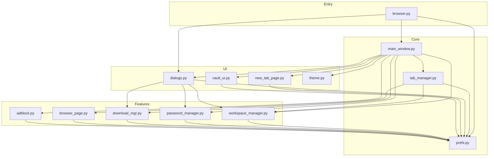
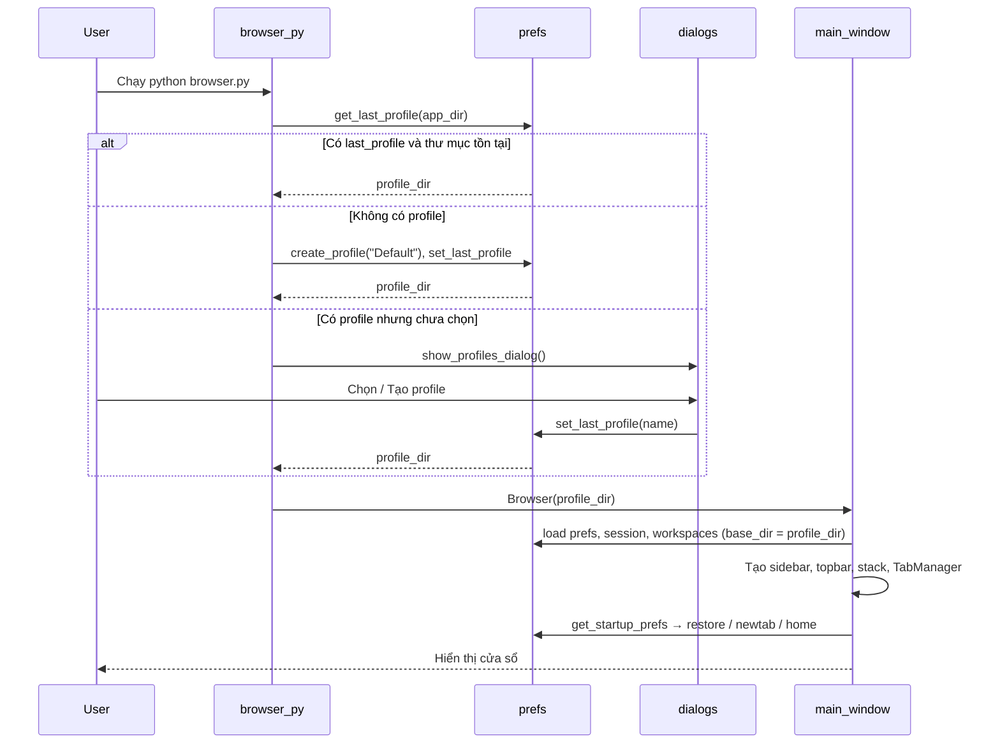
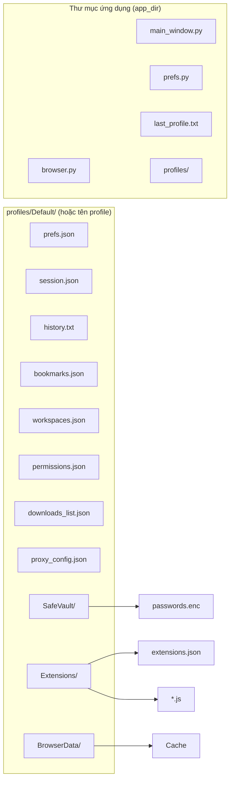
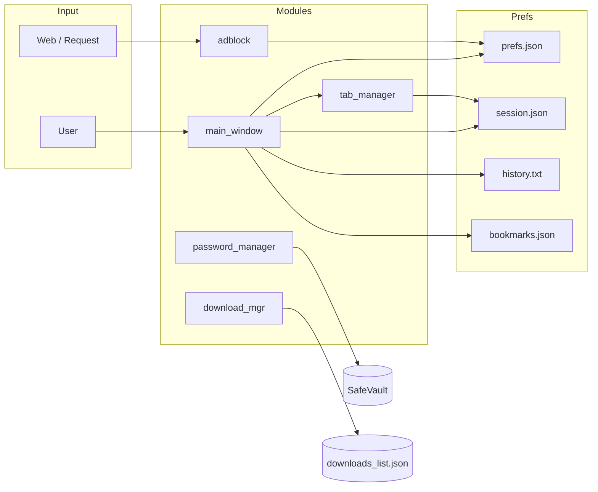

# LiteBrowser Ultimate — Tài liệu tính năng & kiến trúc

> ⚠️ **Tài liệu legacy (thời kỳ 2.0)** — mô tả kiến trúc cũ (`main_window.py` đơn lẻ, PyQt5 thuần).
> Code hiện tại đã chuyển sang shell đa workspace (`litebrowser/ui/app_shell.py`, shim PyQt5/PyQt6)
> và đang ở bản **6.2.0**. **Tài liệu hiện hành: `README.md` (tổng quan + changelog), `RUN_AND_BUILD.md` (chạy & build desktop), `ARCHITECTURE.md` (kiến trúc + roadmap).**

Tài liệu mô tả **mọi tính năng**, **luồng dữ liệu** và **cấu trúc** của LiteBrowser 2.0.

---

## 1. Tổng quan kiến trúc

```
┌─────────────────────────────────────────────────────────────────────────────┐
│                           LiteBrowser Ultimate                               │
├─────────────────────────────────────────────────────────────────────────────┤
│  browser.py (entry)                                                           │
│    → Chọn profile / tạo Default → Khởi tạo Browser(profile_dir)            │
├─────────────────────────────────────────────────────────────────────────────┤
│  main_window.py (Browser = QMainWindow)                                      │
│    ├── Sidebar (workspace, tab list, panels: Tab ★ 🕐 ↓)                    │
│    ├── Top bar (nav, URL, zoom, Tìm, Đọc, ★, Dev) + Home                    │
│    ├── Web stack (QStackedWidget = các tab web)                              │
│    └── TabManager, dialogs, vault_ui, theme                                  │
├─────────────────────────────────────────────────────────────────────────────┤
│  Engine: PyQt5 + QtWebEngine (Chromium)                                       │
└─────────────────────────────────────────────────────────────────────────────┘
```

### 1.1 Sơ đồ phụ thuộc module (Mermaid)



### 1.2 Luồng khởi động (Mermaid)



---

## 2. Cấu trúc thư mục & dữ liệu (theo profile)

Mỗi **profile** có một thư mục: `profiles/<TênProfile>/`. Mọi đường dẫn dưới đây dùng `base_dir` = thư mục profile đó (hoặc `app_dir` khi nói đến profile).



| File / thư mục | Mô tả |
|----------------|-------|
| `last_profile.txt` | Tên profile dùng lần trước (trong app_dir). |
| `profiles/<Name>/` | Thư mục dữ liệu của từng profile. |
| `prefs.json` | Cài đặt: startup_mode, home_url, hibernate_seconds, https_only, password_manager_enabled, autofill_passwords, adblock_filter_file, block_third_party_cookies. |
| `session.json` | Danh sách URL các tab (khôi phục khi mở lại). |
| `history.txt` | Lịch sử: mỗi dòng `timestamp\turl`. |
| `bookmarks.json` | Mảng `[{ "title", "url" }, ...]`. |
| `workspaces.json` | `{ "workspaces": [{ "id", "name" }], "current_id" }`. |
| `permissions.json` | `{ "https://origin": { "geolocation": "allow", ... } }`. |
| `downloads_list.json` | Danh sách tải: url, path, filename, status. |
| `proxy_config.json` | VPN/Proxy: enabled, type, host, port, user, password. |
| `SafeVault/` | Thư mục lưu ghi chú, tệp tải lên; `passwords.enc` (kho mật khẩu mã hóa) nếu bật quản lý mật khẩu. |
| `Extensions/` | File `.js` + `extensions.json` (bật/tắt từng file). |
| `BrowserData/` | Cache, cookie, storage của Qt WebEngine. |

---

## 3. Tính năng chi tiết

### 3.1 Tab & điều hướng

| Tính năng | Mô tả | Phím / UI |
|-----------|--------|-----------|
| Tab mới | Thêm tab (New Tab hoặc URL). Tab mới thuộc workspace đang chọn. | **Ctrl+T**, nút **+ Tab mới** |
| Tab ẩn danh | Tab dùng profile riêng, không lưu cookie/session. | **Ctrl+Shift+N**, menu Tùy chọn |
| Đóng tab | Đóng tab hiện tại (không đóng nếu chỉ còn 1 tab). | **Ctrl+W**, nút × trên tab |
| Nhân bản tab | Mở tab mới với cùng URL (about:newtab → New Tab). | **Ctrl+Shift+D**, chuột phải tab → Nhân bản |
| Chuyển tab | Click tab trên sidebar hoặc dùng Quick Switcher. | Click, **Ctrl+Shift+K** |
| Ghim tab | Tab ghim không đóng được cho đến khi bỏ ghim. | Chuột phải tab → Ghim / Bỏ ghim |
| Ngủ đông tab | Tab không active sau N phút (theo prefs) chuyển sang about:blank để giảm RAM; bấm vào tab để “đánh thức”. | Tự động; thời gian: Tùy chọn → Thời gian ngủ đông tab... |
| Đóng băng toàn bộ | Ngủ đông mọi tab trừ tab đang xem. | Tùy chọn → Đóng băng toàn bộ |
| Back / Forward | Lùi / Tiến trong lịch sử trang. | **Alt+Trái** / **Alt+Phải**, nút ◀ ▶ trên top bar |
| Reload | Tải lại trang. | **F5**, **Ctrl+R**, nút reload |
| Trang chủ | Điều hướng tới URL trang chủ (lấy từ Khi khởi động). | Nút Home trên top bar |
| Thanh địa chỉ | Gõ URL hoặc từ khóa → Enter: tìm kiếm (theo engine đã chọn) hoặc mở URL. | Ô URL giữa top bar |
| Công cụ tìm kiếm | Chọn Google, Perplexity, DuckDuckGo, Bing, Brave Search cho ô tìm. | Combo bên trái ô URL |

### 3.2 Workspace (nhóm tab)

| Tính năng | Mô tả |
|-----------|--------|
| Workspace mặc định | Mỗi profile có workspace "Mặc định"; tab mới gán vào workspace đang chọn. |
| Combo workspace | Trên sidebar, chọn workspace → chỉ hiện tab thuộc workspace đó. |
| Thêm workspace | Tùy chọn → Workspace (nhóm tab)... → Thêm workspace (đặt tên). |
| Xóa workspace | Trong dialog Workspace, chọn workspace (không xóa "Mặc định") → Xóa đã chọn. |
| Dữ liệu | `workspaces.json`: danh sách workspace (id, name) và current_id. |

### 3.3 Sidebar đa panel

| Panel | Nội dung | Tương tác |
|-------|----------|-----------|
| **Tab** | Danh sách tab + workspace combo. | Click chuyển tab; chuột phải: âm thanh, tự tải lại 10s, ghim, nhân bản, đóng. |
| **★ Dấu trang** | Danh sách dấu trang (lazy load khi chọn panel). | Double-click mở URL trong tab mới. |
| **🕐 Lịch sử** | Danh sách lịch sử (lazy load). | Double-click mở URL trong tab mới. |
| **↓ Tải xuống** | Danh sách file đã tải (từ download_mgr). | Double-click mở file (nếu tồn tại). |

- Nút **◀** / **▶** bên cạnh "LiteBrowser": thu gọn sidebar (chỉ còn icon) / mở rộng lại.

### 3.4 New Tab 2.0 (Speed dial)

- **Ô nhanh:** Tối đa 12 ô (ưu tiên 8 dấu trang, còn lại từ lịch sử); mỗi ô: icon ★ + nhãn, link tới URL.
- **Ô tìm kiếm:** Form Google search.
- **Gần đây:** Danh sách ~12 URL gần nhất từ history.
- HTML do `new_tab_page.build_new_tab_html(base_dir)` tạo; dùng `about:newtab` khi mở Tab mới.

### 3.5 Quick Switcher

- **Ctrl+Shift+K**: Mở dialog tìm nhanh.
- **Nguồn:** Tab hiện tại (trong workspace), dấu trang, lịch sử.
- **Hành vi:** Gõ lọc theo title/URL → Enter hoặc double-click: nếu là tab thì chuyển tới tab; nếu bookmark/history thì mở URL trong tab mới (active).

---

## 4. Bảo mật & quyền riêng tư

### 4.1 Adblock & chặn request

| Thành phần | Mô tả |
|------------|--------|
| **TrackingBlocker** (adblock.py) | `QWebEngineUrlRequestInterceptor`: gửi header DNT; chặn request tới danh sách domain (analytics, quảng cáo, tracking). |
| **Danh sách mặc định** | Domain kiểu google-analytics.com, doubleclick.net, facebook.net, hotjar.com, … (xem `adblock._default_blocked_domains()`). |
| **File filter** | Trong Bảo mật: chỉ định file .txt; parse dòng `\|\|domain^` hoặc tên miền, thêm vào set chặn. Gọi `reload_filter_file()` khi lưu. |

### 4.2 Chỉ tải HTTPS

- Trong **Bảo mật (HTTPS, Adblock, Mật khẩu)...** bật **Chỉ tải HTTPS**.
- Trong interceptor: request `http://` (trừ localhost / 127.0.0.1) bị chặn.

### 4.3 Quản lý mật khẩu (cơ bản)

- **Bật:** Bảo mật... → Bật quản lý mật khẩu; **Điền mật khẩu tự động** khi đã lưu.
- **Lưu mật khẩu:** Tùy chọn → Lưu mật khẩu trang này → nhập URL, tên đăng nhập, mật khẩu, mật khẩu chính.
- **Lưu trữ:** `SafeVault/passwords.enc`; mã hóa bằng `cryptography.fernet` + key từ mật khẩu chính (không lưu mật khẩu chính trên đĩa).
- **Autofill:** Khi load trang, nếu bật autofill và có credential cho origin: hỏi mật khẩu chính (một lần phiên) rồi inject script điền form.
- **Yêu cầu:** `pip install cryptography`.

### 4.4 Quyền theo site (notifications, geolocation, mic, camera…)

- **BrowserPage** (browser_page.py): kế thừa `QWebEnginePage`, xử lý `featurePermissionRequested`.
- **permissions.json:** Lưu theo origin, ví dụ `"https://example.com": { "geolocation": "allow", "notifications": "deny" }`.
- Khi site xin quyền: hộp thoại Cho phép / Từ chối / Từ chối hẳn; lưu lựa chọn và áp dụng lần sau.

### 4.5 Chặn cookie bên thứ ba

- Tùy chọn → **Chặn cookie bên thứ ba** (check). Lưu trong prefs; nếu Qt hỗ trợ `cookieStore.setCookieFilter` thì áp dụng, không thì vẫn lưu tùy chọn.

---

## 5. VPN / Proxy, Extensions, Vault

| Tính năng | Mô tả |
|-----------|--------|
| **VPN / Proxy** | Tùy chọn → VPN / Proxy: cấu hình HTTP hoặc SOCKS5 (host, port, user, pass); Lưu vào `proxy_config.json`; Bật/Tắt áp dụng `QNetworkProxy.setApplicationProxy`. |
| **Trình cắm (Extensions)** | Thư mục `Extensions/`: file `.js` + `extensions.json` (bật/tắt từng file). Khi load trang xong, inject các file đang bật. Có nút tạo mẫu SimpleAdblock.js. |
| **Safe Vault** | Tùy chọn → Kho lưu trữ (Safe): dialog quản lý thư mục `SafeVault/`: tạo thư mục, ghi chú .txt, tải tệp lên, xóa, lên thư mục, mở trong Explorer. |

---

## 6. Lịch sử, Dấu trang, Khởi động, Tải xuống

| Tính năng | Chi tiết |
|-----------|----------|
| **Lịch sử** | Tự ghi mỗi URL (http) vào `history.txt`. Tùy chọn → Lịch sử: xem danh sách; Xóa 1h/24h/7 ngày/tất cả; Mở trang đã chọn. |
| **Dấu trang** | Lưu/đọc `bookmarks.json`. Ctrl+D lưu trang hiện tại; Tùy chọn → Dấu trang: xem, Xuất JSON/HTML, Nhập từ file, Mở trang đã chọn. |
| **Khi khởi động** | Tùy chọn → Khi khởi động...: Khôi phục tab (session) / Trang Tab mới / Trang chủ (URL tùy chỉnh). Lưu startup_mode, home_url vào prefs. |
| **Tải xuống** | Khi trang yêu cầu tải: hộp thoại xác nhận (cảnh báo nếu .exe/.bat…); chọn đường dẫn lưu → ghi vào `download_mgr` (downloads_list.json). Tùy chọn → Tải xuống hoặc panel ↓: danh sách, Mở file, Mở thư mục, Xóa khỏi danh sách. |

---

## 7. In, PDF, ảnh, văn bản, DevTools

| Tính năng | Cách dùng |
|-----------|-----------|
| In trang | Tùy chọn → In trang: hộp thoại máy in, gửi in. |
| Lưu PDF | Tùy chọn → Lưu PDF: chọn đường dẫn, `page.printToPdf(path)`. |
| Chụp ảnh trang | **Ctrl+S**, Tùy chọn → Chụp Ảnh Web: lưu ảnh widget (grab) ra file. |
| Trích xuất văn bản | **Ctrl+Shift+E**, Tùy chọn → Lấy Toàn bộ Chữ: `page.toPlainText()` → dialog xem + Sao chép. |
| Tìm trong trang | **Ctrl+F**, nút Tìm: nhập từ khóa → `findText()`. |
| Chế độ đọc | Nút Đọc: inject JS ẩn header/footer/nav/ads, chỉnh style chữ. |
| Ép web màu tối | Tùy chọn → Ép Web màu Tối (check): inject filter invert/hue-rotate cho trang. |
| Developer Tools | Nút Dev: mở cửa sổ riêng với DevTools của Qt WebEngine. |

---

## 8. Giao diện & Theme

- **theme.py:** Bảng màu (MAIN_BG, SIDEBAR_BG, ACCENT…), bán kính, spacing; `main_qss()` trả về QSS cho toàn cửa sổ; `collapse_btn_qss()` cho nút thu gọn sidebar.
- **Top bar:** Nav (Back, Forward, Reload, Home), combo công cụ tìm kiếm, ô URL, zoom (− / 100% / +), Tìm, Đọc, ★, Dev.
- **Zoom:** Một nhãn “100%” (click = reset); không còn hai nút “100%”.
- **Fullscreen:** **F11**.

---

## 9. Phím tắt đầy đủ

| Phím | Hành động |
|------|-----------|
| **Ctrl+T** | Tab mới |
| **Ctrl+Shift+N** | Tab ẩn danh |
| **Ctrl+W** | Đóng tab hiện tại |
| **Ctrl+Shift+D** | Nhân bản tab |
| **Ctrl+Shift+K** | Quick Switcher |
| **F5** / **Ctrl+R** | Tải lại |
| **Alt+Trái** / **Alt+Phải** | Back / Forward |
| **Ctrl+F** | Tìm trong trang |
| **Ctrl+H** | Lịch sử |
| **Ctrl+D** | Lưu dấu trang |
| **Ctrl+S** | Chụp ảnh trang |
| **Ctrl+Shift+E** | Trích xuất văn bản |
| **F11** | Toàn màn hình |

---

## 10. Menu Tùy chọn (cấu trúc)

```mermaid
graph TD
    M[Tùy chọn]
    M --> Hướng_dẫn
    M --> Sep1[---]
    M --> Tab_ẩn_danh
    M --> Chụp_ảnh
    M --> Lấy_chữ
    M --> In_trang
    M --> Lưu_PDF
    M --> Sep2[---]
    M --> Đóng_băng
    M --> Hibernate_pref
    M --> VPN
    M --> Dark_web
    M --> Block_3p_cookies
    M --> Workspace
    M --> Profiles
    M --> Khởi_động
    M --> Lịch_sử
    M --> Dấu_trang
    M --> Trình_cắm
    M --> Tải_xuống
    M --> Vault
    M --> Sep3[---]
    M --> Bảo_mật
    M --> Lưu_mật_khẩu
```



---

## 11. Danh sách dialog (dialogs.py)

| Hàm | Mô tả |
|-----|--------|
| `show_vpn_dialog(parent)` | Cấu hình proxy, Bật/Tắt. |
| `show_startup_dialog(parent)` | Chọn hành vi khởi động + URL trang chủ. |
| `show_hibernate_pref_dialog(parent)` | Chọn thời gian ngủ đông tab (Tắt / 1–30 phút). |
| `show_history_dialog(parent)` | Danh sách lịch sử, Xóa 1h/24h/7d/tất cả, Mở trang đã chọn. |
| `show_bookmarks_dialog(parent)` | Danh sách dấu trang, Xuất JSON/HTML, Nhập, Mở trang đã chọn. |
| `show_extensions_dialog(parent)` | Danh sách .js, bật/tắt, Tạo mẫu Adblock. |
| `show_guide(parent)` | Hộp thoại hướng dẫn phím tắt & mẹo. |
| `show_workspace_dialog(parent)` | Thêm / Xóa workspace. |
| `show_quick_switcher(parent)` | Tìm tab/bookmark/history, Enter mở/chuyển. |
| `show_downloads_dialog(parent)` | Danh sách tải, Mở file, Mở thư mục, Xóa khỏi danh sách. |
| `show_profiles_dialog(parent, app_dir)` | Chọn/Tạo/Xóa profile; “Dùng profile này” → đặt last_profile. |
| `show_privacy_dialog(parent)` | HTTPS-only, file Adblock, Bật quản lý mật khẩu, Điền mật khẩu tự động. |
| `show_save_password_dialog(parent)` | Nhập URL, user, password, mật khẩu chính để lưu vào kho. |
| `ask_master_password(parent, title)` | Nhập mật khẩu chính (cho autofill / mở kho). |

---

## 12. Sơ đồ luồng dữ liệu chính (Mermaid)



---

## 13. Tóm tắt file Python theo vai trò

| File | Vai trò chính |
|------|----------------|
| **browser.py** | Entry: chọn profile, tạo app, khởi tạo Browser(profile_dir). |
| **main_window.py** | QMainWindow: layout sidebar/topbar/stack, shortcut, menu, tích hợp tab_manager/dialogs/vault/new_tab/theme. |
| **tab_manager.py** | Thêm/đóng/ghim/nhân bản/ngủ đông tab, đổi tab, đếm Active/Hibernate; dùng workspace_id trên từng tab. |
| **prefs.py** | Đường dẫn (session, history, bookmarks, vault, ext, proxy, permissions, downloads, workspaces, profiles); load/save prefs, session, history, bookmarks, workspaces, permissions, profile (last/list/create/delete). |
| **dialogs.py** | Tất cả dialog: VPN, Startup, Hibernate, History, Bookmarks, Extensions, Guide, Workspace, Quick Switcher, Downloads, Profiles, Bảo mật, Lưu mật khẩu. |
| **new_tab_page.py** | `build_new_tab_html(base_dir)`: speed dial (bookmarks + history) + ô tìm + Gần đây. |
| **vault_ui.py** | Dialog Safe Vault: cây thư mục, ghi chú, tải lên, xóa, mở Explorer. |
| **theme.py** | Hằng màu/spacing/radius; `main_qss()`, `collapse_btn_qss()`. |
| **adblock.py** | TrackingBlocker (interceptor), domain blocklist, load filter file, HTTPS-only. |
| **workspace_manager.py** | load/save workspaces, get/set current_id, add/remove/rename workspace. |
| **password_manager.py** | Mã hóa Fernet, save/load/add/get credentials, script autofill. |
| **download_mgr.py** | load_list/save_list, add_download, update_status, remove_download. |
| **browser_page.py** | QWebEnginePage tùy chỉnh: featurePermissionRequested → permissions.json, prompt Cho phép/Từ chối. |

---

*Tài liệu này mô tả đầy đủ tính năng và kiến trúc LiteBrowser 2.0. Cập nhật khi thêm tính năng mới.*
