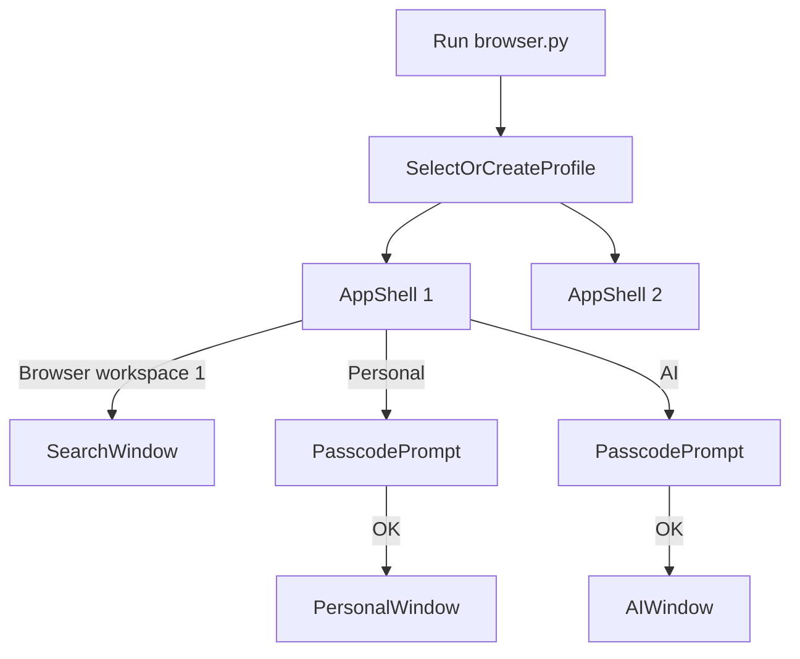
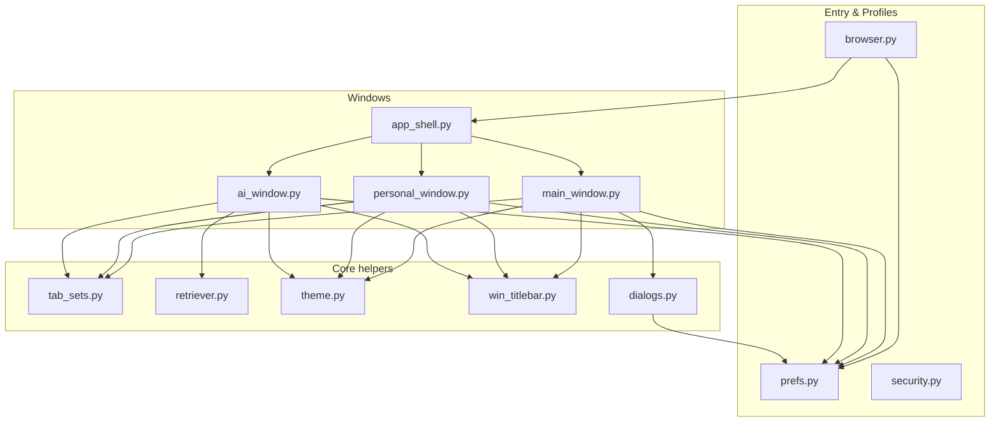
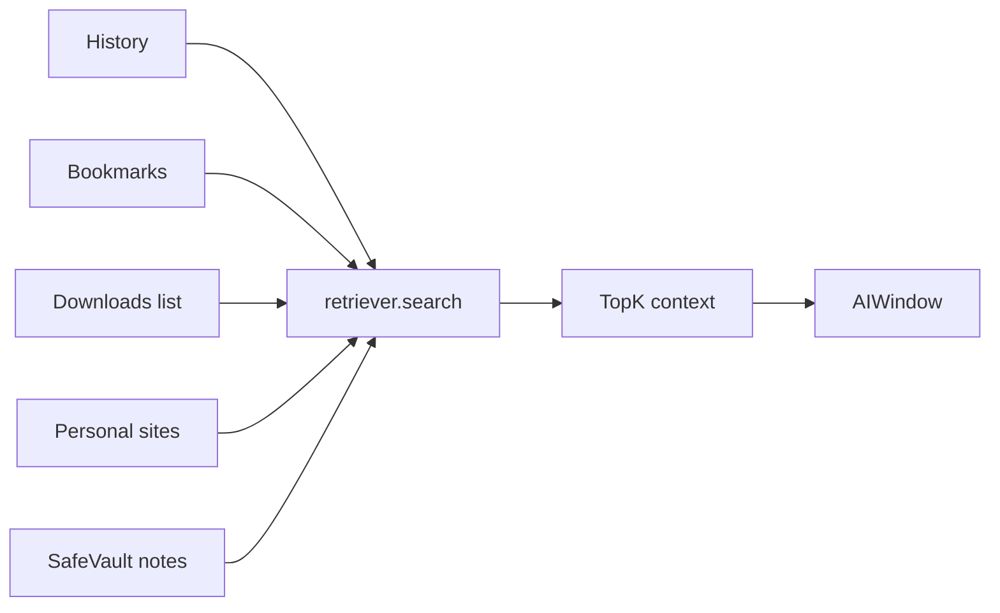

## LiteBrowser 3.0 – Overview

> ⚠️ **Tài liệu legacy (thời kỳ 3.0)** — thông tin có thể lỗi thời so với code hiện tại (bản **6.2.0**, shell đa workspace + shim PyQt5/PyQt6). **Tài liệu hiện hành: `README.md`, `RUN_AND_BUILD.md`, `ARCHITECTURE.md`.**

LiteBrowser 3.0 là trình duyệt mini với 3 khu vực tách biệt:

- **Search Browser**: cửa sổ duyệt web chính (tab, workspace, history, bookmarks, downloads, extensions, VPN/proxy, adblock…).
- **Personal Hub**: khu vực file & website cá nhân, mở bằng mật mã.
- **AI Hub**: màn hình hỏi AI, không dùng API key; mặc định dùng dữ liệu trình duyệt + personal, có thể nâng cấp dùng local LLM.
- Luồng chính hiện tại chạy từ **AppShell** sau khi chọn profile.



---

## Architecture



---

## Features

### Search Browser

- **Tab & điều hướng**
  - Tab mới, tab ẩn danh, đóng/nhân bản tab, ghim, “đóng băng” (ngủ đông hàng loạt), back/forward, reload, trang chủ.
  - Thanh địa chỉ: nhận URL hoặc từ khóa; hỗ trợ nhiều công cụ tìm kiếm (Google, Perplexity, DuckDuckGo, Bing, Brave Search).
  - Zoom với nhãn “100%” bấm để reset.

- **Workspace & Sidebar**
  - Workspace (nhóm tab) theo profile, lưu trong `workspaces.json`.
  - Sidebar 4 panel: Tab, Dấu trang, Lịch sử, Tải xuống; có nút thu gọn để chỉ còn icon.

- **History & Bookmarks & Downloads**
  - Lịch sử: lưu `history.txt`, dialog lịch sử hỗ trợ xoá 1h/24h/7d/tất cả và mở trang đã chọn.
  - Dấu trang: lưu `bookmarks.json`, dialog dấu trang hỗ trợ xem/xuất/nhập/mở.
  - Download manager: `downloads_list.json`, dialog tải xuống cho phép mở file, mở thư mục, xoá khỏi danh sách.

- **Security & Privacy**
  - Chỉ tải HTTPS (tùy chọn trong dialog Bảo mật).
  - Tracking/ad blocker qua `adblock.py` với domain list mặc định + file filter tùy chọn.
  - Quản lý mật khẩu cơ bản (mã hóa với `cryptography`, lưu ở `SafeVault/passwords.enc`, autofill form).
  - Quyền theo site (notifications, geolocation, mic/camera…) lưu trong `permissions.json`, xử lý qua `BrowserPage`.
  - Chặn cookie bên thứ ba (nếu Qt hỗ trợ cookie filter).

- **Tools & tiện ích**
  - Chụp ảnh trang, lưu PDF, in trang.
  - Trích xuất toàn bộ văn bản trang vào dialog.
  - Chế độ đọc (Reader Mode).
  - Ép web màu tối (dark web filter).
  - Developer Tools (cửa sổ riêng).

### Personal Hub

- **Files**
  - Chọn “thư mục gốc” (personal root) và duyệt nhanh danh sách file/thư mục.
  - Double-click mở bằng Explorer/ứng dụng mặc định.

- **Sites**
  - Danh sách website cá nhân riêng (khác bookmarks chung), lưu trong `prefs.personal_sites`.
  - Thêm/xóa site, hiển thị ngay trong view bên phải với `QWebEngineView`.

- **Notes (placeholder)**
  - Kênh để sau này kết nối chặt hơn với `SafeVault` (ghi chú, tài liệu riêng).

### AI Hub

- **Chế độ mặc định (không LLM)**
  - Dùng `retriever.py` để index nhẹ các nguồn:
    - History, bookmarks, downloads list, personal sites, ghi chú text/markdown trong SafeVault.
  - Trả về danh sách kết quả + “trả lời dạng rule-based” dễ hiểu.

- **Local LLM (tùy chọn)**
  - Thử phát hiện **Ollama** (qua `ollama list`) và cung cấp lựa chọn model trong combobox.
  - Tuỳ chọn gọi endpoint `llama.cpp` local (qua HTTP) nếu người dùng đã chạy server.
  - Không dùng API key hay service bên ngoài; tất cả chạy trên máy.

### Tab Sets / listtab

- Tự động snapshot bộ tab:
  - Khi đóng Search Browser: snapshot “Search auto …”.
  - Khi đóng Personal Hub: snapshot dựa trên danh sách personal sites.
  - Khi đóng AI Hub: snapshot dựa trên lịch sử câu hỏi gần đây.
- Lưu trong `tab_sets.json` (theo profile) qua module `tab_sets.py`.
- Nút **“Lưu bộ tab hiện tại…”** trong Search, **“Lưu bộ Personal hiện tại…”** trong Personal, **“Lưu phiên AI…”** trong AI để lưu thủ công với tên tuỳ chọn.

### Passcode & Profiles

- Mỗi app có nhiều profile (thư mục `profiles/<name>`).
- Mỗi profile có thể đặt **passcode** qua module `security.py`:
  - Lưu hash + salt + rounds trong `prefs.json`.
  - Mở Personal/AI cần nhập passcode; có option “nhớ trong phiên”.

### Theme & Title Bar

- Theme vintage tối ấm trong `theme.py`:
  - Nền tối ấm, chữ ngà, accent đồng/brass.
  - Áp dụng cho mọi QMainWindow, dialog, menu, input.
- Native title bar (Windows) dùng `win_titlebar.apply_dark_titlebar` để bật immersive dark mode cho Search, Personal, AI, Launcher.

---

## Shortcuts

| Phím | Hành động |
|------|-----------|
| Ctrl+T | Tab mới |
| Ctrl+Shift+N | Tab ẩn danh |
| Ctrl+W | Đóng tab hiện tại |
| Ctrl+Shift+D | Nhân bản tab |
| Ctrl+Shift+K | Quick Switcher |
| F5 / Ctrl+R | Tải lại trang |
| Alt+Trái / Alt+Phải | Back / Forward |
| Ctrl+F | Tìm trong trang |
| Ctrl+H | Lịch sử |
| Ctrl+D | Lưu dấu trang |
| Ctrl+S | Chụp ảnh trang |
| Ctrl+Shift+E | Trích xuất văn bản |
| F11 | Toàn màn hình |

---

## Data flow (AI retrieval)



---

## Build as .EXE on Windows

### Chuẩn bị môi trường

1. Cài **Python 3.10+** trên Windows (bật “Add Python to PATH” nếu muốn).
2. Tạo virtualenv (khuyến nghị) trong thư mục project:

```bash
python -m venv .venv
.venv\Scripts\activate
```

3. Cài các dependency chính (tuỳ theo `requirements` của bạn):

```bash
pip install PyQt5 PyQtWebEngine cryptography pyinstaller
```

python -m PyInstaller LiteBrowser.spec --noconfirm

Sau khi build:

- Copy các resource cần thiết (ví dụ `icon.png`, thư mục `profiles` rỗng nếu muốn, v.v.) vào cùng thư mục với `browser.exe` nếu app cần.
- Test chạy `browser.exe` trên máy dev trước khi chia sẻ.

### Lưu ý về SmartScreen / antivirus

- File `.exe` tự build chưa ký code có thể bị SmartScreen cảnh báo “App from unknown publisher”.
- Cách giảm cảnh báo:
  - Nén thành `.zip` và gửi trong phạm vi tin cậy (team nội bộ, máy cá nhân).
  - Nếu cần phân phối rộng, nên xem xét **code signing certificate** và ký exe.

### Tùy chọn: Installer (Inno Setup / NSIS)

- Bạn có thể dùng **Inno Setup** hoặc **NSIS** để:
  - Tạo installer chuẩn với bước Next/Next/Finish.
  - Tạo desktop shortcut, Start Menu entry, gỡ cài đặt.
- Luồng cơ bản:
  - Dùng PyInstaller sinh `browser.exe`.
  - Trong Inno Setup, chọn thư mục `dist/browser` làm “Application directory”.
  - Khai báo shortcut tới `browser.exe` và build file `.exe` installer.

---

## Advanced Notes

- Tất cả dữ liệu người dùng (session, history, bookmarks, tab_sets, SafeVault, v.v.) đều nằm trong thư mục profile tương ứng (`profiles/<name>`), dễ sao lưu và di chuyển.
- Passcode chỉ dùng để khóa UI (gating) cho Personal/AI, không thay thế việc mã hóa toàn bộ ổ đĩa.
## Ghi chú mở app

- Không thể đọc ra mật khẩu hiện tại từ repo này.
- Profile `Default` đang lưu `passcode_hash` trong `profiles/Default/prefs.json`, tức là chỉ có hash, không có mật khẩu gốc để xem ngược lại.
- Nếu mở `Personal Hub` hoặc `AI Hub` mà app hỏi mật khẩu thì đó là passcode đã được đặt trước đó trên profile này.
- Nếu profile chưa có passcode thì app sẽ yêu cầu tự tạo mật khẩu mới ở lần mở đầu tiên.

### CMD để chạy app

Chạy ngay trong thư mục project:

```bat
cd /d "d:\Code folder\new browser"
python browser.py
```

Hoặc chạy file batch có sẵn:

```bat
cd /d "d:\Code folder\new browser"
run.bat
```

Nếu máy chưa có thư viện, cài trước:

```bat
cd /d "d:\Code folder\new browser"
python -m pip install -r requirements.txt
python browser.py
```

---
